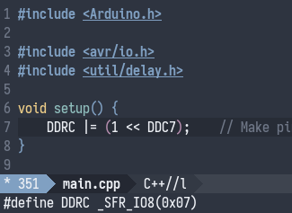

- [Motivation](#orgdc92d2c)
- [But first&#x2026;](#orgbc3662c)
- [Let's build it](#org4607280)
  - [Pre-processing](#org9e79169)
  - [Dependency resolution](#orgbb05c01)
  - [Compilation](#org8c75c3e)
    - [Compiling main](#orgf593c1c)

PS: this is a literate programming document. This means everything is derived from a single file, the [avr-cmake.org](./avr-cmake.md). Here's the small makefile to generate the examples and the readme:

```makefile
all: examples README.md
examples: avr-cmake.org
	time emacs --batch --no-init-file --load .org-mode.emacs.el --find-file avr-cmake.org --funcall org-babel-tangle --kill
README.md: avr-cmake.org
	time emacs --batch --load .org-mode.emacs.el --find-file avr-cmake.org --eval '(export-gfm "README.md")' --kill
clean:
	-rm -rf README.md examples
```


<a id="orgdc92d2c"></a>

# Motivation

The Arduino toolchain is a great tool: they abstracted away the whole build process, and made such a good job that anyone with a very basic knowledge of programming can get up and running real quick.

The problem arises when you get old and grumpy like me: I have a setup for programming that I like to stick to, and I always have some niceties that I find super annoying if they're missing, and they are missing with the basic Arduino setup.

My demands: be able to use Emacs with code completion and jump to definition. The first demand is fulfilled when using [arduino-cli](https://github.com/arduino/arduino-cli). It's super easy to compile and upload a program using it. The second one not so much, and that's where CMake comes in.

CMake has a huge community and, when you do it right, it comes with a lot of free benefits. The most interesting one for me is the [ability to generate clangd's config file](https://releases.llvm.org/8.0.0/tools/clang/tools/extra/docs/clangd/Installation.html#compile-commands-json).

By the way, there's a project that tries to cover this use but it's still not quite what I want. They do a great job at automatically finding stuff, but it still relies on `avr-gcc=/=avr-g++`, which is not what I want (`avr/*` includes for instance are not resolved properly).


<a id="orgbc3662c"></a>

# But first&#x2026;

PS: The rest of the document assumes CMake, clang/LLVM and arduino-cli are available.

Now we need some code to test the whole project against. I only have access to a [Zumo 32U4](https://www.pololu.com/docs/0J63/5) from Pololu, so that's what I'll be using for testing.

For that we need to also install their libraries and their core:

```sh
arduino-cli core install pololu-a-star:avr
arduino-cli lib install Zumo32U4
```

The first one is a led buzzer. Since it uses the minimum amount of libraries it should be a good starting point:

```arduino
#include <avr/io.h>
#include <util/delay.h>

void setup() {
    DDRC |= (1 << DDC7);    // Make pin 13 be an output.
}

void loop () {
    PORTC |= (1 << PORTC7);   // Turn the LED on.
    _delay_ms(500);
    PORTC &= ~(1 << PORTC7);  // Turn the LED off.
    _delay_ms(500);
}
```

The second one is another example from them, but now it uses their libraries.

```arduino
/* This example shows how to use the Zumo 32U4's LSM303D
accelerometer and L3GD20H gyro to balance on its front end.
Please note that the balancing algorithm in this code is not
perfect: the robot tends to drift away from its starting position
over time.  We found that this code works better on carpet than
on a hard surface.
You will have to remove the Zumo's blade if one is installed.
After removing the blade, be sure to reinstall the screws that
were holding the blade.
This code is sensitive to changes in the Zumo's center of mass,
so make sure the LCD is plugged in.
This code was designed for Zumos with 75:1 HP micro metal
gearmotors, and it might need to be adjusted to work on Zumos
with other types of motors. */

#include <Wire.h>
#include <Zumo32U4.h>

Zumo32U4LCD lcd;
Zumo32U4ButtonA buttonA;
Zumo32U4ButtonB buttonB;
Zumo32U4ButtonC buttonC;
Zumo32U4Motors motors;
Zumo32U4Buzzer buzzer;

L3G gyro;
LSM303 compass;

// This is the average reading obtained from the gyro's Y axis
// during calibration.
float gyroOffsetY;

// This variable holds our estimation of the robot's angle based
// on the gyro and the accelerometer.  A value of 0 means the
// robot is perfectly vertical.  A value of -90 means that the
// robot is horizontal and the battery holder is facing down.  A
// value of 90 means that the robot is horizontal and the battery
// holder is facing up.
float angle = 0;

// This is just like "angle", but it is based solely on the
// accelerometer.
float aAngle = 0;

void setup()
{
  Wire.begin();

  // Set up the L3GD20H gyro.
  gyro.init();

  // 800 Hz output data rate,
  // low-pass filter cutoff 100 Hz.
  gyro.writeReg(L3G::CTRL1, 0b11111111);

  // 2000 dps full scale.
  gyro.writeReg(L3G::CTRL4, 0b00100000);

  // High-pass filter disabled.
  gyro.writeReg(L3G::CTRL5, 0b00000000);

  // Set up the LSM303D accelerometer.
  compass.init();

  // 50 Hz output data rate
  compass.writeReg(LSM303::CTRL1, 0x57);

  // 8 g full-scale
  compass.writeReg(LSM303::CTRL2, 0x18);

  lcd.clear();
  lcd.print(F("Gyro cal"));
  ledYellow(1);

  // Delay to give the user time to remove their finger.
  delay(500);

  // Calibrate the gyro.
  for (uint16_t i = 0; i < 1024; i++)
  {
    // Wait for new data to be available, then read it.
    while(!(gyro.readReg(L3G::STATUS_REG) & 0x08));
    gyro.read();

    // Add the Y axis reading to the total.
    gyroOffsetY += gyro.g.y;
  }
  gyroOffsetY /= 1024;

  lcd.clear();
  ledYellow(0);

  // Display the angle until the user presses A.
  while (!buttonA.getSingleDebouncedRelease())
  {
    // Update the angle using the gyro as often as possible.
    updateAngleGyro();

    // Every 20 ms (50 Hz), correct the angle using the
    // accelerometer and also print it.
    static uint8_t lastCorrectionTime = 0;
    uint8_t m = millis();
    if ((uint8_t)(m - lastCorrectionTime) >= 20)
    {
      lastCorrectionTime = m;
      correctAngleAccel();
      printAngles();
    }
  }
  delay(500);
}

void loop()
{
  // Update the angle using the gyro as often as possible.
  updateAngleGyro();

  // Every 20 ms (50 Hz), correct the angle using the
  // accelerometer, print it, and set the motor speeds.
  static byte lastCorrectionTime = 0;
  byte m = millis();
  if ((byte)(m - lastCorrectionTime) >= 20)
  {
    lastCorrectionTime = m;
    correctAngleAccel();
    printAngles();
    setMotors();
  }
}

void printAngles()
{
  lcd.gotoXY(0, 0);
  lcd.print(angle);
  lcd.print(F("  "));

  lcd.gotoXY(0, 1);
  lcd.print(aAngle);
  lcd.print("  ");
}

// Reads the gyro and uses it to update the angle estimation.
void updateAngleGyro()
{
  // Figure out how much time has passed since the last update.
  static uint16_t lastUpdate = 0;
  uint16_t m = micros();
  uint16_t dt = m - lastUpdate;
  lastUpdate = m;

  gyro.read();

  // Calculate how much the angle has changed, in degrees, and
  // add it to our estimation of the current angle.  The gyro's
  // sensitivity is 0.07 dps per digit.
  angle += ((float)gyro.g.y - gyroOffsetY) * 70 * dt / 1000000000;
}

// Reads the accelerometer and uses it to adjust the angle
// estimation.
void correctAngleAccel()
{
  compass.read();

  // Calculate the angle according to the accelerometer.
  aAngle = -atan2(compass.a.z, -compass.a.x) * 180 / M_PI;

  // Calculate the magnitude of the measured acceleration vector,
  // in units of g.
  LSM303::vector<float> const aInG = {
    (float)compass.a.x / 4096,
    (float)compass.a.y / 4096,
    (float)compass.a.z / 4096}
  ;
  float mag = sqrt(LSM303::vector_dot(&aInG, &aInG));

  // Calculate how much weight we should give to the
  // accelerometer reading.  When the magnitude is not close to
  // 1 g, we trust it less because it is being influenced by
  // non-gravity accelerations, so we give it a lower weight.
  float weight = 1 - 5 * abs(1 - mag);
  weight = constrain(weight, 0, 1);
  weight /= 10;

  // Adjust the angle estimation.  The higher the weight, the
  // more the angle gets adjusted.
  angle = weight * aAngle + (1 - weight) * angle;
}

// This function uses our current angle estimation and a PID
// algorithm to set the motor speeds.  This is the core of the
// robot's balancing algorithm.
void setMotors()
{
  const float targetAngle = 2.0;

  int32_t speed;
  if (abs(angle) > 45)
  {
    // If the robot is tilted more than 45 degrees, it is
    // probably going to fall over.  Stop the motors to prevent
    // it from running away.
    speed = 0;
  }
  else
  {
    static float lastError = 0;
    static float integral = 0;

    float error = angle - targetAngle;

    integral += error;
    integral = constrain(integral, -40, 40);

    float errorDifference = error - lastError;
    speed = error * 35 + errorDifference * 10 + integral * 5;
    speed = constrain(speed, -400, 400);

    lastError = error;
  }
  motors.setSpeeds(speed, speed);
}
```


<a id="org4607280"></a>

# Let's build it

Let's start from the available Arduino documentation about its [build process](https://arduino.github.io/arduino-cli/sketch-build-process/).


<a id="org9e79169"></a>

## Pre-processing

It basically adds the arduino header and a main function to a sketch. Let's do that manually, since the goal here is to work with plain C++ files.

```c++
#include <Arduino.h>

#include <avr/io.h>
#include <util/delay.h>

void setup() {
    DDRC |= (1 << DDC7);    // Make pin 13 be an output.
}

void loop () {
    PORTC |= (1 << PORTC7);   // Turn the LED on.
    _delay_ms(500);
    PORTC &= ~(1 << PORTC7);  // Turn the LED off.
    _delay_ms(500);
}

int main() {
    setup();

    while(1) loop();
}
```

```c++
#include <Arduino.h>

/* This example shows how to use the Zumo 32U4's LSM303D
accelerometer and L3GD20H gyro to balance on its front end.
Please note that the balancing algorithm in this code is not
perfect: the robot tends to drift away from its starting position
over time.  We found that this code works better on carpet than
on a hard surface.
You will have to remove the Zumo's blade if one is installed.
After removing the blade, be sure to reinstall the screws that
were holding the blade.
This code is sensitive to changes in the Zumo's center of mass,
so make sure the LCD is plugged in.
This code was designed for Zumos with 75:1 HP micro metal
gearmotors, and it might need to be adjusted to work on Zumos
with other types of motors. */

#include <Wire.h>
#include <Zumo32U4.h>

Zumo32U4LCD lcd;
Zumo32U4ButtonA buttonA;
Zumo32U4ButtonB buttonB;
Zumo32U4ButtonC buttonC;
Zumo32U4Motors motors;
Zumo32U4Buzzer buzzer;

L3G gyro;
LSM303 compass;

// This is the average reading obtained from the gyro's Y axis
// during calibration.
float gyroOffsetY;

// This variable holds our estimation of the robot's angle based
// on the gyro and the accelerometer.  A value of 0 means the
// robot is perfectly vertical.  A value of -90 means that the
// robot is horizontal and the battery holder is facing down.  A
// value of 90 means that the robot is horizontal and the battery
// holder is facing up.
float angle = 0;

// This is just like "angle", but it is based solely on the
// accelerometer.
float aAngle = 0;

void setup()
{
  Wire.begin();

  // Set up the L3GD20H gyro.
  gyro.init();

  // 800 Hz output data rate,
  // low-pass filter cutoff 100 Hz.
  gyro.writeReg(L3G::CTRL1, 0b11111111);

  // 2000 dps full scale.
  gyro.writeReg(L3G::CTRL4, 0b00100000);

  // High-pass filter disabled.
  gyro.writeReg(L3G::CTRL5, 0b00000000);

  // Set up the LSM303D accelerometer.
  compass.init();

  // 50 Hz output data rate
  compass.writeReg(LSM303::CTRL1, 0x57);

  // 8 g full-scale
  compass.writeReg(LSM303::CTRL2, 0x18);

  lcd.clear();
  lcd.print(F("Gyro cal"));
  ledYellow(1);

  // Delay to give the user time to remove their finger.
  delay(500);

  // Calibrate the gyro.
  for (uint16_t i = 0; i < 1024; i++)
  {
    // Wait for new data to be available, then read it.
    while(!(gyro.readReg(L3G::STATUS_REG) & 0x08));
    gyro.read();

    // Add the Y axis reading to the total.
    gyroOffsetY += gyro.g.y;
  }
  gyroOffsetY /= 1024;

  lcd.clear();
  ledYellow(0);

  // Display the angle until the user presses A.
  while (!buttonA.getSingleDebouncedRelease())
  {
    // Update the angle using the gyro as often as possible.
    updateAngleGyro();

    // Every 20 ms (50 Hz), correct the angle using the
    // accelerometer and also print it.
    static uint8_t lastCorrectionTime = 0;
    uint8_t m = millis();
    if ((uint8_t)(m - lastCorrectionTime) >= 20)
    {
      lastCorrectionTime = m;
      correctAngleAccel();
      printAngles();
    }
  }
  delay(500);
}

void loop()
{
  // Update the angle using the gyro as often as possible.
  updateAngleGyro();

  // Every 20 ms (50 Hz), correct the angle using the
  // accelerometer, print it, and set the motor speeds.
  static byte lastCorrectionTime = 0;
  byte m = millis();
  if ((byte)(m - lastCorrectionTime) >= 20)
  {
    lastCorrectionTime = m;
    correctAngleAccel();
    printAngles();
    setMotors();
  }
}

void printAngles()
{
  lcd.gotoXY(0, 0);
  lcd.print(angle);
  lcd.print(F("  "));

  lcd.gotoXY(0, 1);
  lcd.print(aAngle);
  lcd.print("  ");
}

// Reads the gyro and uses it to update the angle estimation.
void updateAngleGyro()
{
  // Figure out how much time has passed since the last update.
  static uint16_t lastUpdate = 0;
  uint16_t m = micros();
  uint16_t dt = m - lastUpdate;
  lastUpdate = m;

  gyro.read();

  // Calculate how much the angle has changed, in degrees, and
  // add it to our estimation of the current angle.  The gyro's
  // sensitivity is 0.07 dps per digit.
  angle += ((float)gyro.g.y - gyroOffsetY) * 70 * dt / 1000000000;
}

// Reads the accelerometer and uses it to adjust the angle
// estimation.
void correctAngleAccel()
{
  compass.read();

  // Calculate the angle according to the accelerometer.
  aAngle = -atan2(compass.a.z, -compass.a.x) * 180 / M_PI;

  // Calculate the magnitude of the measured acceleration vector,
  // in units of g.
  LSM303::vector<float> const aInG = {
    (float)compass.a.x / 4096,
    (float)compass.a.y / 4096,
    (float)compass.a.z / 4096}
  ;
  float mag = sqrt(LSM303::vector_dot(&aInG, &aInG));

  // Calculate how much weight we should give to the
  // accelerometer reading.  When the magnitude is not close to
  // 1 g, we trust it less because it is being influenced by
  // non-gravity accelerations, so we give it a lower weight.
  float weight = 1 - 5 * abs(1 - mag);
  weight = constrain(weight, 0, 1);
  weight /= 10;

  // Adjust the angle estimation.  The higher the weight, the
  // more the angle gets adjusted.
  angle = weight * aAngle + (1 - weight) * angle;
}

// This function uses our current angle estimation and a PID
// algorithm to set the motor speeds.  This is the core of the
// robot's balancing algorithm.
void setMotors()
{
  const float targetAngle = 2.0;

  int32_t speed;
  if (abs(angle) > 45)
  {
    // If the robot is tilted more than 45 degrees, it is
    // probably going to fall over.  Stop the motors to prevent
    // it from running away.
    speed = 0;
  }
  else
  {
    static float lastError = 0;
    static float integral = 0;

    float error = angle - targetAngle;

    integral += error;
    integral = constrain(integral, -40, 40);

    float errorDifference = error - lastError;
    speed = error * 35 + errorDifference * 10 + integral * 5;
    speed = constrain(speed, -400, 400);

    lastError = error;
  }
  motors.setSpeeds(speed, speed);
}

int main() {
    setup();

    while(1) loop();
}
```


<a id="orgbb05c01"></a>

## Dependency resolution

We can take a look at the output from arduino-cli to have an idea:

```sh
arduino-cli compile --fqbn pololu-a-star:avr:a-star32U4 -v --dry-run .
```

    Using board 'a-star32U4' from platform in folder: /home/caio/.arduino15/packages/pololu-a-star/hardware/avr/4.0.2
    Using core 'arduino' from platform in folder: /home/caio/.arduino15/packages/arduino/hardware/avr/1.8.3
    Detecting libraries used...
    /home/caio/.arduino15/packages/arduino/tools/avr-gcc/7.3.0-atmel3.6.1-arduino7/bin/avr-g++ -c -g -Os -w -std=gnu++11 -fpermissive -fno-exceptions -ffunction-sections -fdata-sections -fno-threadsafe-statics -Wno-error=narrowing -flto -w -x c++ -E -CC -mmcu=atmega32u4 -DF_CPU=16000000L -DARDUINO=10607 -DARDUINO_AVR_A_STAR_32U4 -DARDUINO_ARCH_AVR -DUSB_VID=0x1ffb -DUSB_PID=0x2300 "-DUSB_MANUFACTURER=\"Pololu Corporation\"" "-DUSB_PRODUCT=\"Pololu A-Star 32U4\"" -I/home/caio/.arduino15/packages/arduino/hardware/avr/1.8.3/cores/arduino -I/home/caio/.arduino15/packages/arduino/hardware/avr/1.8.3/variants/leonardo /tmp/arduino-sketch-5058F1AF8388633F609CADB75A75DC9D/sketch/sketch.ino.cpp -o /dev/null -DARDUINO_LIB_DISCOVERY_PHASE
    Alternatives for Wire.h: [Wire@1.0]
    ResolveLibrary(Wire.h)
      -> candidates: [Wire@1.0]
    /home/caio/.arduino15/packages/arduino/tools/avr-gcc/7.3.0-atmel3.6.1-arduino7/bin/avr-g++ -c -g -Os -w -std=gnu++11 -fpermissive -fno-exceptions -ffunction-sections -fdata-sections -fno-threadsafe-statics -Wno-error=narrowing -flto -w -x c++ -E -CC -mmcu=atmega32u4 -DF_CPU=16000000L -DARDUINO=10607 -DARDUINO_AVR_A_STAR_32U4 -DARDUINO_ARCH_AVR -DUSB_VID=0x1ffb -DUSB_PID=0x2300 "-DUSB_MANUFACTURER=\"Pololu Corporation\"" "-DUSB_PRODUCT=\"Pololu A-Star 32U4\"" -I/home/caio/.arduino15/packages/arduino/hardware/avr/1.8.3/cores/arduino -I/home/caio/.arduino15/packages/arduino/hardware/avr/1.8.3/variants/leonardo -I/home/caio/.arduino15/packages/arduino/hardware/avr/1.8.3/libraries/Wire/src /tmp/arduino-sketch-5058F1AF8388633F609CADB75A75DC9D/sketch/sketch.ino.cpp -o /dev/null -DARDUINO_LIB_DISCOVERY_PHASE
    Alternatives for Zumo32U4.h: [Zumo32U4@1.1.4]
    ResolveLibrary(Zumo32U4.h)
      -> candidates: [Zumo32U4@1.1.4]
    /home/caio/.arduino15/packages/arduino/tools/avr-gcc/7.3.0-atmel3.6.1-arduino7/bin/avr-g++ -c -g -Os -w -std=gnu++11 -fpermissive -fno-exceptions -ffunction-sections -fdata-sections -fno-threadsafe-statics -Wno-error=narrowing -flto -w -x c++ -E -CC -mmcu=atmega32u4 -DF_CPU=16000000L -DARDUINO=10607 -DARDUINO_AVR_A_STAR_32U4 -DARDUINO_ARCH_AVR -DUSB_VID=0x1ffb -DUSB_PID=0x2300 "-DUSB_MANUFACTURER=\"Pololu Corporation\"" "-DUSB_PRODUCT=\"Pololu A-Star 32U4\"" -I/home/caio/.arduino15/packages/arduino/hardware/avr/1.8.3/cores/arduino -I/home/caio/.arduino15/packages/arduino/hardware/avr/1.8.3/variants/leonardo -I/home/caio/.arduino15/packages/arduino/hardware/avr/1.8.3/libraries/Wire/src -I/home/caio/Arduino/libraries/Zumo32U4 /tmp/arduino-sketch-5058F1AF8388633F609CADB75A75DC9D/sketch/sketch.ino.cpp -o /dev/null -DARDUINO_LIB_DISCOVERY_PHASE
    /home/caio/.arduino15/packages/arduino/tools/avr-gcc/7.3.0-atmel3.6.1-arduino7/bin/avr-g++ -c -g -Os -w -std=gnu++11 -fpermissive -fno-exceptions -ffunction-sections -fdata-sections -fno-threadsafe-statics -Wno-error=narrowing -flto -w -x c++ -E -CC -mmcu=atmega32u4 -DF_CPU=16000000L -DARDUINO=10607 -DARDUINO_AVR_A_STAR_32U4 -DARDUINO_ARCH_AVR -DUSB_VID=0x1ffb -DUSB_PID=0x2300 "-DUSB_MANUFACTURER=\"Pololu Corporation\"" "-DUSB_PRODUCT=\"Pololu A-Star 32U4\"" -I/home/caio/.arduino15/packages/arduino/hardware/avr/1.8.3/cores/arduino -I/home/caio/.arduino15/packages/arduino/hardware/avr/1.8.3/variants/leonardo -I/home/caio/.arduino15/packages/arduino/hardware/avr/1.8.3/libraries/Wire/src -I/home/caio/Arduino/libraries/Zumo32U4 /home/caio/.arduino15/packages/arduino/hardware/avr/1.8.3/libraries/Wire/src/Wire.cpp -o /dev/null -DARDUINO_LIB_DISCOVERY_PHASE
    /home/caio/.arduino15/packages/arduino/tools/avr-gcc/7.3.0-atmel3.6.1-arduino7/bin/avr-g++ -c -g -Os -w -std=gnu++11 -fpermissive -fno-exceptions -ffunction-sections -fdata-sections -fno-threadsafe-statics -Wno-error=narrowing -flto -w -x c++ -E -CC -mmcu=atmega32u4 -DF_CPU=16000000L -DARDUINO=10607 -DARDUINO_AVR_A_STAR_32U4 -DARDUINO_ARCH_AVR -DUSB_VID=0x1ffb -DUSB_PID=0x2300 "-DUSB_MANUFACTURER=\"Pololu Corporation\"" "-DUSB_PRODUCT=\"Pololu A-Star 32U4\"" -I/home/caio/.arduino15/packages/arduino/hardware/avr/1.8.3/cores/arduino -I/home/caio/.arduino15/packages/arduino/hardware/avr/1.8.3/variants/leonardo -I/home/caio/.arduino15/packages/arduino/hardware/avr/1.8.3/libraries/Wire/src -I/home/caio/Arduino/libraries/Zumo32U4 /home/caio/.arduino15/packages/arduino/hardware/avr/1.8.3/libraries/Wire/src/utility/twi.c -o /dev/null -DARDUINO_LIB_DISCOVERY_PHASE
    /home/caio/.arduino15/packages/arduino/tools/avr-gcc/7.3.0-atmel3.6.1-arduino7/bin/avr-g++ -c -g -Os -w -std=gnu++11 -fpermissive -fno-exceptions -ffunction-sections -fdata-sections -fno-threadsafe-statics -Wno-error=narrowing -flto -w -x c++ -E -CC -mmcu=atmega32u4 -DF_CPU=16000000L -DARDUINO=10607 -DARDUINO_AVR_A_STAR_32U4 -DARDUINO_ARCH_AVR -DUSB_VID=0x1ffb -DUSB_PID=0x2300 "-DUSB_MANUFACTURER=\"Pololu Corporation\"" "-DUSB_PRODUCT=\"Pololu A-Star 32U4\"" -I/home/caio/.arduino15/packages/arduino/hardware/avr/1.8.3/cores/arduino -I/home/caio/.arduino15/packages/arduino/hardware/avr/1.8.3/variants/leonardo -I/home/caio/.arduino15/packages/arduino/hardware/avr/1.8.3/libraries/Wire/src -I/home/caio/Arduino/libraries/Zumo32U4 /home/caio/Arduino/libraries/Zumo32U4/L3G.cpp -o /dev/null -DARDUINO_LIB_DISCOVERY_PHASE
    /home/caio/.arduino15/packages/arduino/tools/avr-gcc/7.3.0-atmel3.6.1-arduino7/bin/avr-g++ -c -g -Os -w -std=gnu++11 -fpermissive -fno-exceptions -ffunction-sections -fdata-sections -fno-threadsafe-statics -Wno-error=narrowing -flto -w -x c++ -E -CC -mmcu=atmega32u4 -DF_CPU=16000000L -DARDUINO=10607 -DARDUINO_AVR_A_STAR_32U4 -DARDUINO_ARCH_AVR -DUSB_VID=0x1ffb -DUSB_PID=0x2300 "-DUSB_MANUFACTURER=\"Pololu Corporation\"" "-DUSB_PRODUCT=\"Pololu A-Star 32U4\"" -I/home/caio/.arduino15/packages/arduino/hardware/avr/1.8.3/cores/arduino -I/home/caio/.arduino15/packages/arduino/hardware/avr/1.8.3/variants/leonardo -I/home/caio/.arduino15/packages/arduino/hardware/avr/1.8.3/libraries/Wire/src -I/home/caio/Arduino/libraries/Zumo32U4 /home/caio/Arduino/libraries/Zumo32U4/LSM303.cpp -o /dev/null -DARDUINO_LIB_DISCOVERY_PHASE
    /home/caio/.arduino15/packages/arduino/tools/avr-gcc/7.3.0-atmel3.6.1-arduino7/bin/avr-g++ -c -g -Os -w -std=gnu++11 -fpermissive -fno-exceptions -ffunction-sections -fdata-sections -fno-threadsafe-statics -Wno-error=narrowing -flto -w -x c++ -E -CC -mmcu=atmega32u4 -DF_CPU=16000000L -DARDUINO=10607 -DARDUINO_AVR_A_STAR_32U4 -DARDUINO_ARCH_AVR -DUSB_VID=0x1ffb -DUSB_PID=0x2300 "-DUSB_MANUFACTURER=\"Pololu Corporation\"" "-DUSB_PRODUCT=\"Pololu A-Star 32U4\"" -I/home/caio/.arduino15/packages/arduino/hardware/avr/1.8.3/cores/arduino -I/home/caio/.arduino15/packages/arduino/hardware/avr/1.8.3/variants/leonardo -I/home/caio/.arduino15/packages/arduino/hardware/avr/1.8.3/libraries/Wire/src -I/home/caio/Arduino/libraries/Zumo32U4 /home/caio/Arduino/libraries/Zumo32U4/PololuBuzzer.cpp -o /dev/null -DARDUINO_LIB_DISCOVERY_PHASE
    /home/caio/.arduino15/packages/arduino/tools/avr-gcc/7.3.0-atmel3.6.1-arduino7/bin/avr-g++ -c -g -Os -w -std=gnu++11 -fpermissive -fno-exceptions -ffunction-sections -fdata-sections -fno-threadsafe-statics -Wno-error=narrowing -flto -w -x c++ -E -CC -mmcu=atmega32u4 -DF_CPU=16000000L -DARDUINO=10607 -DARDUINO_AVR_A_STAR_32U4 -DARDUINO_ARCH_AVR -DUSB_VID=0x1ffb -DUSB_PID=0x2300 "-DUSB_MANUFACTURER=\"Pololu Corporation\"" "-DUSB_PRODUCT=\"Pololu A-Star 32U4\"" -I/home/caio/.arduino15/packages/arduino/hardware/avr/1.8.3/cores/arduino -I/home/caio/.arduino15/packages/arduino/hardware/avr/1.8.3/variants/leonardo -I/home/caio/.arduino15/packages/arduino/hardware/avr/1.8.3/libraries/Wire/src -I/home/caio/Arduino/libraries/Zumo32U4 /home/caio/Arduino/libraries/Zumo32U4/PololuHD44780.cpp -o /dev/null -DARDUINO_LIB_DISCOVERY_PHASE
    /home/caio/.arduino15/packages/arduino/tools/avr-gcc/7.3.0-atmel3.6.1-arduino7/bin/avr-g++ -c -g -Os -w -std=gnu++11 -fpermissive -fno-exceptions -ffunction-sections -fdata-sections -fno-threadsafe-statics -Wno-error=narrowing -flto -w -x c++ -E -CC -mmcu=atmega32u4 -DF_CPU=16000000L -DARDUINO=10607 -DARDUINO_AVR_A_STAR_32U4 -DARDUINO_ARCH_AVR -DUSB_VID=0x1ffb -DUSB_PID=0x2300 "-DUSB_MANUFACTURER=\"Pololu Corporation\"" "-DUSB_PRODUCT=\"Pololu A-Star 32U4\"" -I/home/caio/.arduino15/packages/arduino/hardware/avr/1.8.3/cores/arduino -I/home/caio/.arduino15/packages/arduino/hardware/avr/1.8.3/variants/leonardo -I/home/caio/.arduino15/packages/arduino/hardware/avr/1.8.3/libraries/Wire/src -I/home/caio/Arduino/libraries/Zumo32U4 /home/caio/Arduino/libraries/Zumo32U4/Pushbutton.cpp -o /dev/null -DARDUINO_LIB_DISCOVERY_PHASE
    /home/caio/.arduino15/packages/arduino/tools/avr-gcc/7.3.0-atmel3.6.1-arduino7/bin/avr-g++ -c -g -Os -w -std=gnu++11 -fpermissive -fno-exceptions -ffunction-sections -fdata-sections -fno-threadsafe-statics -Wno-error=narrowing -flto -w -x c++ -E -CC -mmcu=atmega32u4 -DF_CPU=16000000L -DARDUINO=10607 -DARDUINO_AVR_A_STAR_32U4 -DARDUINO_ARCH_AVR -DUSB_VID=0x1ffb -DUSB_PID=0x2300 "-DUSB_MANUFACTURER=\"Pololu Corporation\"" "-DUSB_PRODUCT=\"Pololu A-Star 32U4\"" -I/home/caio/.arduino15/packages/arduino/hardware/avr/1.8.3/cores/arduino -I/home/caio/.arduino15/packages/arduino/hardware/avr/1.8.3/variants/leonardo -I/home/caio/.arduino15/packages/arduino/hardware/avr/1.8.3/libraries/Wire/src -I/home/caio/Arduino/libraries/Zumo32U4 /home/caio/Arduino/libraries/Zumo32U4/QTRSensors.cpp -o /dev/null -DARDUINO_LIB_DISCOVERY_PHASE
    /home/caio/.arduino15/packages/arduino/tools/avr-gcc/7.3.0-atmel3.6.1-arduino7/bin/avr-g++ -c -g -Os -w -std=gnu++11 -fpermissive -fno-exceptions -ffunction-sections -fdata-sections -fno-threadsafe-statics -Wno-error=narrowing -flto -w -x c++ -E -CC -mmcu=atmega32u4 -DF_CPU=16000000L -DARDUINO=10607 -DARDUINO_AVR_A_STAR_32U4 -DARDUINO_ARCH_AVR -DUSB_VID=0x1ffb -DUSB_PID=0x2300 "-DUSB_MANUFACTURER=\"Pololu Corporation\"" "-DUSB_PRODUCT=\"Pololu A-Star 32U4\"" -I/home/caio/.arduino15/packages/arduino/hardware/avr/1.8.3/cores/arduino -I/home/caio/.arduino15/packages/arduino/hardware/avr/1.8.3/variants/leonardo -I/home/caio/.arduino15/packages/arduino/hardware/avr/1.8.3/libraries/Wire/src -I/home/caio/Arduino/libraries/Zumo32U4 /home/caio/Arduino/libraries/Zumo32U4/Zumo32U4Encoders.cpp -o /dev/null -DARDUINO_LIB_DISCOVERY_PHASE
    /home/caio/.arduino15/packages/arduino/tools/avr-gcc/7.3.0-atmel3.6.1-arduino7/bin/avr-g++ -c -g -Os -w -std=gnu++11 -fpermissive -fno-exceptions -ffunction-sections -fdata-sections -fno-threadsafe-statics -Wno-error=narrowing -flto -w -x c++ -E -CC -mmcu=atmega32u4 -DF_CPU=16000000L -DARDUINO=10607 -DARDUINO_AVR_A_STAR_32U4 -DARDUINO_ARCH_AVR -DUSB_VID=0x1ffb -DUSB_PID=0x2300 "-DUSB_MANUFACTURER=\"Pololu Corporation\"" "-DUSB_PRODUCT=\"Pololu A-Star 32U4\"" -I/home/caio/.arduino15/packages/arduino/hardware/avr/1.8.3/cores/arduino -I/home/caio/.arduino15/packages/arduino/hardware/avr/1.8.3/variants/leonardo -I/home/caio/.arduino15/packages/arduino/hardware/avr/1.8.3/libraries/Wire/src -I/home/caio/Arduino/libraries/Zumo32U4 /home/caio/Arduino/libraries/Zumo32U4/Zumo32U4IRPulses.cpp -o /dev/null -DARDUINO_LIB_DISCOVERY_PHASE
    /home/caio/.arduino15/packages/arduino/tools/avr-gcc/7.3.0-atmel3.6.1-arduino7/bin/avr-g++ -c -g -Os -w -std=gnu++11 -fpermissive -fno-exceptions -ffunction-sections -fdata-sections -fno-threadsafe-statics -Wno-error=narrowing -flto -w -x c++ -E -CC -mmcu=atmega32u4 -DF_CPU=16000000L -DARDUINO=10607 -DARDUINO_AVR_A_STAR_32U4 -DARDUINO_ARCH_AVR -DUSB_VID=0x1ffb -DUSB_PID=0x2300 "-DUSB_MANUFACTURER=\"Pololu Corporation\"" "-DUSB_PRODUCT=\"Pololu A-Star 32U4\"" -I/home/caio/.arduino15/packages/arduino/hardware/avr/1.8.3/cores/arduino -I/home/caio/.arduino15/packages/arduino/hardware/avr/1.8.3/variants/leonardo -I/home/caio/.arduino15/packages/arduino/hardware/avr/1.8.3/libraries/Wire/src -I/home/caio/Arduino/libraries/Zumo32U4 /home/caio/Arduino/libraries/Zumo32U4/Zumo32U4Motors.cpp -o /dev/null -DARDUINO_LIB_DISCOVERY_PHASE
    /home/caio/.arduino15/packages/arduino/tools/avr-gcc/7.3.0-atmel3.6.1-arduino7/bin/avr-g++ -c -g -Os -w -std=gnu++11 -fpermissive -fno-exceptions -ffunction-sections -fdata-sections -fno-threadsafe-statics -Wno-error=narrowing -flto -w -x c++ -E -CC -mmcu=atmega32u4 -DF_CPU=16000000L -DARDUINO=10607 -DARDUINO_AVR_A_STAR_32U4 -DARDUINO_ARCH_AVR -DUSB_VID=0x1ffb -DUSB_PID=0x2300 "-DUSB_MANUFACTURER=\"Pololu Corporation\"" "-DUSB_PRODUCT=\"Pololu A-Star 32U4\"" -I/home/caio/.arduino15/packages/arduino/hardware/avr/1.8.3/cores/arduino -I/home/caio/.arduino15/packages/arduino/hardware/avr/1.8.3/variants/leonardo -I/home/caio/.arduino15/packages/arduino/hardware/avr/1.8.3/libraries/Wire/src -I/home/caio/Arduino/libraries/Zumo32U4 /home/caio/Arduino/libraries/Zumo32U4/Zumo32U4ProximitySensors.cpp -o /dev/null -DARDUINO_LIB_DISCOVERY_PHASE
    Generating function prototypes...
    /home/caio/.arduino15/packages/arduino/tools/avr-gcc/7.3.0-atmel3.6.1-arduino7/bin/avr-g++ -c -g -Os -w -std=gnu++11 -fpermissive -fno-exceptions -ffunction-sections -fdata-sections -fno-threadsafe-statics -Wno-error=narrowing -flto -w -x c++ -E -CC -mmcu=atmega32u4 -DF_CPU=16000000L -DARDUINO=10607 -DARDUINO_AVR_A_STAR_32U4 -DARDUINO_ARCH_AVR -DUSB_VID=0x1ffb -DUSB_PID=0x2300 "-DUSB_MANUFACTURER=\"Pololu Corporation\"" "-DUSB_PRODUCT=\"Pololu A-Star 32U4\"" -I/home/caio/.arduino15/packages/arduino/hardware/avr/1.8.3/cores/arduino -I/home/caio/.arduino15/packages/arduino/hardware/avr/1.8.3/variants/leonardo -I/home/caio/.arduino15/packages/arduino/hardware/avr/1.8.3/libraries/Wire/src -I/home/caio/Arduino/libraries/Zumo32U4 /tmp/arduino-sketch-5058F1AF8388633F609CADB75A75DC9D/sketch/sketch.ino.cpp -o /tmp/arduino-sketch-5058F1AF8388633F609CADB75A75DC9D/preproc/ctags_target_for_gcc_minus_e.cpp -DARDUINO_LIB_DISCOVERY_PHASE
    /home/caio/.arduino15/packages/builtin/tools/ctags/5.8-arduino11/ctags -u --language-force=c++ -f - --c++-kinds=svpf --fields=KSTtzns --line-directives /tmp/arduino-sketch-5058F1AF8388633F609CADB75A75DC9D/preproc/ctags_target_for_gcc_minus_e.cpp
    Compiling sketch...
    /home/caio/.arduino15/packages/arduino/tools/avr-gcc/7.3.0-atmel3.6.1-arduino7/bin/avr-g++ -c -g -Os -w -std=gnu++11 -fpermissive -fno-exceptions -ffunction-sections -fdata-sections -fno-threadsafe-statics -Wno-error=narrowing -MMD -flto -mmcu=atmega32u4 -DF_CPU=16000000L -DARDUINO=10607 -DARDUINO_AVR_A_STAR_32U4 -DARDUINO_ARCH_AVR -DUSB_VID=0x1ffb -DUSB_PID=0x2300 "-DUSB_MANUFACTURER=\"Pololu Corporation\"" "-DUSB_PRODUCT=\"Pololu A-Star 32U4\"" -I/home/caio/.arduino15/packages/arduino/hardware/avr/1.8.3/cores/arduino -I/home/caio/.arduino15/packages/arduino/hardware/avr/1.8.3/variants/leonardo -I/home/caio/.arduino15/packages/arduino/hardware/avr/1.8.3/libraries/Wire/src -I/home/caio/Arduino/libraries/Zumo32U4 /tmp/arduino-sketch-5058F1AF8388633F609CADB75A75DC9D/sketch/sketch.ino.cpp -o /tmp/arduino-sketch-5058F1AF8388633F609CADB75A75DC9D/sketch/sketch.ino.cpp.o
    Compiling libraries...
    Compiling library "Wire"
    /home/caio/.arduino15/packages/arduino/tools/avr-gcc/7.3.0-atmel3.6.1-arduino7/bin/avr-g++ -c -g -Os -w -std=gnu++11 -fpermissive -fno-exceptions -ffunction-sections -fdata-sections -fno-threadsafe-statics -Wno-error=narrowing -MMD -flto -mmcu=atmega32u4 -DF_CPU=16000000L -DARDUINO=10607 -DARDUINO_AVR_A_STAR_32U4 -DARDUINO_ARCH_AVR -DUSB_VID=0x1ffb -DUSB_PID=0x2300 "-DUSB_MANUFACTURER=\"Pololu Corporation\"" "-DUSB_PRODUCT=\"Pololu A-Star 32U4\"" -I/home/caio/.arduino15/packages/arduino/hardware/avr/1.8.3/cores/arduino -I/home/caio/.arduino15/packages/arduino/hardware/avr/1.8.3/variants/leonardo -I/home/caio/.arduino15/packages/arduino/hardware/avr/1.8.3/libraries/Wire/src -I/home/caio/Arduino/libraries/Zumo32U4 /home/caio/.arduino15/packages/arduino/hardware/avr/1.8.3/libraries/Wire/src/Wire.cpp -o /tmp/arduino-sketch-5058F1AF8388633F609CADB75A75DC9D/libraries/Wire/Wire.cpp.o
    /home/caio/.arduino15/packages/arduino/tools/avr-gcc/7.3.0-atmel3.6.1-arduino7/bin/avr-gcc -c -g -Os -w -std=gnu11 -ffunction-sections -fdata-sections -MMD -flto -fno-fat-lto-objects -mmcu=atmega32u4 -DF_CPU=16000000L -DARDUINO=10607 -DARDUINO_AVR_A_STAR_32U4 -DARDUINO_ARCH_AVR -DUSB_VID=0x1ffb -DUSB_PID=0x2300 "-DUSB_MANUFACTURER=\"Pololu Corporation\"" "-DUSB_PRODUCT=\"Pololu A-Star 32U4\"" -I/home/caio/.arduino15/packages/arduino/hardware/avr/1.8.3/cores/arduino -I/home/caio/.arduino15/packages/arduino/hardware/avr/1.8.3/variants/leonardo -I/home/caio/.arduino15/packages/arduino/hardware/avr/1.8.3/libraries/Wire/src -I/home/caio/Arduino/libraries/Zumo32U4 /home/caio/.arduino15/packages/arduino/hardware/avr/1.8.3/libraries/Wire/src/utility/twi.c -o /tmp/arduino-sketch-5058F1AF8388633F609CADB75A75DC9D/libraries/Wire/utility/twi.c.o
    Compiling library "Zumo32U4"
    /home/caio/.arduino15/packages/arduino/tools/avr-gcc/7.3.0-atmel3.6.1-arduino7/bin/avr-g++ -c -g -Os -w -std=gnu++11 -fpermissive -fno-exceptions -ffunction-sections -fdata-sections -fno-threadsafe-statics -Wno-error=narrowing -MMD -flto -mmcu=atmega32u4 -DF_CPU=16000000L -DARDUINO=10607 -DARDUINO_AVR_A_STAR_32U4 -DARDUINO_ARCH_AVR -DUSB_VID=0x1ffb -DUSB_PID=0x2300 "-DUSB_MANUFACTURER=\"Pololu Corporation\"" "-DUSB_PRODUCT=\"Pololu A-Star 32U4\"" -I/home/caio/.arduino15/packages/arduino/hardware/avr/1.8.3/cores/arduino -I/home/caio/.arduino15/packages/arduino/hardware/avr/1.8.3/variants/leonardo -I/home/caio/.arduino15/packages/arduino/hardware/avr/1.8.3/libraries/Wire/src -I/home/caio/Arduino/libraries/Zumo32U4 /home/caio/Arduino/libraries/Zumo32U4/L3G.cpp -o /tmp/arduino-sketch-5058F1AF8388633F609CADB75A75DC9D/libraries/Zumo32U4/L3G.cpp.o
    /home/caio/.arduino15/packages/arduino/tools/avr-gcc/7.3.0-atmel3.6.1-arduino7/bin/avr-g++ -c -g -Os -w -std=gnu++11 -fpermissive -fno-exceptions -ffunction-sections -fdata-sections -fno-threadsafe-statics -Wno-error=narrowing -MMD -flto -mmcu=atmega32u4 -DF_CPU=16000000L -DARDUINO=10607 -DARDUINO_AVR_A_STAR_32U4 -DARDUINO_ARCH_AVR -DUSB_VID=0x1ffb -DUSB_PID=0x2300 "-DUSB_MANUFACTURER=\"Pololu Corporation\"" "-DUSB_PRODUCT=\"Pololu A-Star 32U4\"" -I/home/caio/.arduino15/packages/arduino/hardware/avr/1.8.3/cores/arduino -I/home/caio/.arduino15/packages/arduino/hardware/avr/1.8.3/variants/leonardo -I/home/caio/.arduino15/packages/arduino/hardware/avr/1.8.3/libraries/Wire/src -I/home/caio/Arduino/libraries/Zumo32U4 /home/caio/Arduino/libraries/Zumo32U4/Zumo32U4Encoders.cpp -o /tmp/arduino-sketch-5058F1AF8388633F609CADB75A75DC9D/libraries/Zumo32U4/Zumo32U4Encoders.cpp.o
    /home/caio/.arduino15/packages/arduino/tools/avr-gcc/7.3.0-atmel3.6.1-arduino7/bin/avr-g++ -c -g -Os -w -std=gnu++11 -fpermissive -fno-exceptions -ffunction-sections -fdata-sections -fno-threadsafe-statics -Wno-error=narrowing -MMD -flto -mmcu=atmega32u4 -DF_CPU=16000000L -DARDUINO=10607 -DARDUINO_AVR_A_STAR_32U4 -DARDUINO_ARCH_AVR -DUSB_VID=0x1ffb -DUSB_PID=0x2300 "-DUSB_MANUFACTURER=\"Pololu Corporation\"" "-DUSB_PRODUCT=\"Pololu A-Star 32U4\"" -I/home/caio/.arduino15/packages/arduino/hardware/avr/1.8.3/cores/arduino -I/home/caio/.arduino15/packages/arduino/hardware/avr/1.8.3/variants/leonardo -I/home/caio/.arduino15/packages/arduino/hardware/avr/1.8.3/libraries/Wire/src -I/home/caio/Arduino/libraries/Zumo32U4 /home/caio/Arduino/libraries/Zumo32U4/LSM303.cpp -o /tmp/arduino-sketch-5058F1AF8388633F609CADB75A75DC9D/libraries/Zumo32U4/LSM303.cpp.o
    /home/caio/.arduino15/packages/arduino/tools/avr-gcc/7.3.0-atmel3.6.1-arduino7/bin/avr-g++ -c -g -Os -w -std=gnu++11 -fpermissive -fno-exceptions -ffunction-sections -fdata-sections -fno-threadsafe-statics -Wno-error=narrowing -MMD -flto -mmcu=atmega32u4 -DF_CPU=16000000L -DARDUINO=10607 -DARDUINO_AVR_A_STAR_32U4 -DARDUINO_ARCH_AVR -DUSB_VID=0x1ffb -DUSB_PID=0x2300 "-DUSB_MANUFACTURER=\"Pololu Corporation\"" "-DUSB_PRODUCT=\"Pololu A-Star 32U4\"" -I/home/caio/.arduino15/packages/arduino/hardware/avr/1.8.3/cores/arduino -I/home/caio/.arduino15/packages/arduino/hardware/avr/1.8.3/variants/leonardo -I/home/caio/.arduino15/packages/arduino/hardware/avr/1.8.3/libraries/Wire/src -I/home/caio/Arduino/libraries/Zumo32U4 /home/caio/Arduino/libraries/Zumo32U4/Zumo32U4Motors.cpp -o /tmp/arduino-sketch-5058F1AF8388633F609CADB75A75DC9D/libraries/Zumo32U4/Zumo32U4Motors.cpp.o
    /home/caio/.arduino15/packages/arduino/tools/avr-gcc/7.3.0-atmel3.6.1-arduino7/bin/avr-g++ -c -g -Os -w -std=gnu++11 -fpermissive -fno-exceptions -ffunction-sections -fdata-sections -fno-threadsafe-statics -Wno-error=narrowing -MMD -flto -mmcu=atmega32u4 -DF_CPU=16000000L -DARDUINO=10607 -DARDUINO_AVR_A_STAR_32U4 -DARDUINO_ARCH_AVR -DUSB_VID=0x1ffb -DUSB_PID=0x2300 "-DUSB_MANUFACTURER=\"Pololu Corporation\"" "-DUSB_PRODUCT=\"Pololu A-Star 32U4\"" -I/home/caio/.arduino15/packages/arduino/hardware/avr/1.8.3/cores/arduino -I/home/caio/.arduino15/packages/arduino/hardware/avr/1.8.3/variants/leonardo -I/home/caio/.arduino15/packages/arduino/hardware/avr/1.8.3/libraries/Wire/src -I/home/caio/Arduino/libraries/Zumo32U4 /home/caio/Arduino/libraries/Zumo32U4/Zumo32U4ProximitySensors.cpp -o /tmp/arduino-sketch-5058F1AF8388633F609CADB75A75DC9D/libraries/Zumo32U4/Zumo32U4ProximitySensors.cpp.o
    /home/caio/.arduino15/packages/arduino/tools/avr-gcc/7.3.0-atmel3.6.1-arduino7/bin/avr-g++ -c -g -Os -w -std=gnu++11 -fpermissive -fno-exceptions -ffunction-sections -fdata-sections -fno-threadsafe-statics -Wno-error=narrowing -MMD -flto -mmcu=atmega32u4 -DF_CPU=16000000L -DARDUINO=10607 -DARDUINO_AVR_A_STAR_32U4 -DARDUINO_ARCH_AVR -DUSB_VID=0x1ffb -DUSB_PID=0x2300 "-DUSB_MANUFACTURER=\"Pololu Corporation\"" "-DUSB_PRODUCT=\"Pololu A-Star 32U4\"" -I/home/caio/.arduino15/packages/arduino/hardware/avr/1.8.3/cores/arduino -I/home/caio/.arduino15/packages/arduino/hardware/avr/1.8.3/variants/leonardo -I/home/caio/.arduino15/packages/arduino/hardware/avr/1.8.3/libraries/Wire/src -I/home/caio/Arduino/libraries/Zumo32U4 /home/caio/Arduino/libraries/Zumo32U4/PololuBuzzer.cpp -o /tmp/arduino-sketch-5058F1AF8388633F609CADB75A75DC9D/libraries/Zumo32U4/PololuBuzzer.cpp.o
    /home/caio/.arduino15/packages/arduino/tools/avr-gcc/7.3.0-atmel3.6.1-arduino7/bin/avr-g++ -c -g -Os -w -std=gnu++11 -fpermissive -fno-exceptions -ffunction-sections -fdata-sections -fno-threadsafe-statics -Wno-error=narrowing -MMD -flto -mmcu=atmega32u4 -DF_CPU=16000000L -DARDUINO=10607 -DARDUINO_AVR_A_STAR_32U4 -DARDUINO_ARCH_AVR -DUSB_VID=0x1ffb -DUSB_PID=0x2300 "-DUSB_MANUFACTURER=\"Pololu Corporation\"" "-DUSB_PRODUCT=\"Pololu A-Star 32U4\"" -I/home/caio/.arduino15/packages/arduino/hardware/avr/1.8.3/cores/arduino -I/home/caio/.arduino15/packages/arduino/hardware/avr/1.8.3/variants/leonardo -I/home/caio/.arduino15/packages/arduino/hardware/avr/1.8.3/libraries/Wire/src -I/home/caio/Arduino/libraries/Zumo32U4 /home/caio/Arduino/libraries/Zumo32U4/PololuHD44780.cpp -o /tmp/arduino-sketch-5058F1AF8388633F609CADB75A75DC9D/libraries/Zumo32U4/PololuHD44780.cpp.o
    /home/caio/.arduino15/packages/arduino/tools/avr-gcc/7.3.0-atmel3.6.1-arduino7/bin/avr-g++ -c -g -Os -w -std=gnu++11 -fpermissive -fno-exceptions -ffunction-sections -fdata-sections -fno-threadsafe-statics -Wno-error=narrowing -MMD -flto -mmcu=atmega32u4 -DF_CPU=16000000L -DARDUINO=10607 -DARDUINO_AVR_A_STAR_32U4 -DARDUINO_ARCH_AVR -DUSB_VID=0x1ffb -DUSB_PID=0x2300 "-DUSB_MANUFACTURER=\"Pololu Corporation\"" "-DUSB_PRODUCT=\"Pololu A-Star 32U4\"" -I/home/caio/.arduino15/packages/arduino/hardware/avr/1.8.3/cores/arduino -I/home/caio/.arduino15/packages/arduino/hardware/avr/1.8.3/variants/leonardo -I/home/caio/.arduino15/packages/arduino/hardware/avr/1.8.3/libraries/Wire/src -I/home/caio/Arduino/libraries/Zumo32U4 /home/caio/Arduino/libraries/Zumo32U4/QTRSensors.cpp -o /tmp/arduino-sketch-5058F1AF8388633F609CADB75A75DC9D/libraries/Zumo32U4/QTRSensors.cpp.o
    /home/caio/.arduino15/packages/arduino/tools/avr-gcc/7.3.0-atmel3.6.1-arduino7/bin/avr-g++ -c -g -Os -w -std=gnu++11 -fpermissive -fno-exceptions -ffunction-sections -fdata-sections -fno-threadsafe-statics -Wno-error=narrowing -MMD -flto -mmcu=atmega32u4 -DF_CPU=16000000L -DARDUINO=10607 -DARDUINO_AVR_A_STAR_32U4 -DARDUINO_ARCH_AVR -DUSB_VID=0x1ffb -DUSB_PID=0x2300 "-DUSB_MANUFACTURER=\"Pololu Corporation\"" "-DUSB_PRODUCT=\"Pololu A-Star 32U4\"" -I/home/caio/.arduino15/packages/arduino/hardware/avr/1.8.3/cores/arduino -I/home/caio/.arduino15/packages/arduino/hardware/avr/1.8.3/variants/leonardo -I/home/caio/.arduino15/packages/arduino/hardware/avr/1.8.3/libraries/Wire/src -I/home/caio/Arduino/libraries/Zumo32U4 /home/caio/Arduino/libraries/Zumo32U4/Zumo32U4IRPulses.cpp -o /tmp/arduino-sketch-5058F1AF8388633F609CADB75A75DC9D/libraries/Zumo32U4/Zumo32U4IRPulses.cpp.o
    /home/caio/.arduino15/packages/arduino/tools/avr-gcc/7.3.0-atmel3.6.1-arduino7/bin/avr-g++ -c -g -Os -w -std=gnu++11 -fpermissive -fno-exceptions -ffunction-sections -fdata-sections -fno-threadsafe-statics -Wno-error=narrowing -MMD -flto -mmcu=atmega32u4 -DF_CPU=16000000L -DARDUINO=10607 -DARDUINO_AVR_A_STAR_32U4 -DARDUINO_ARCH_AVR -DUSB_VID=0x1ffb -DUSB_PID=0x2300 "-DUSB_MANUFACTURER=\"Pololu Corporation\"" "-DUSB_PRODUCT=\"Pololu A-Star 32U4\"" -I/home/caio/.arduino15/packages/arduino/hardware/avr/1.8.3/cores/arduino -I/home/caio/.arduino15/packages/arduino/hardware/avr/1.8.3/variants/leonardo -I/home/caio/.arduino15/packages/arduino/hardware/avr/1.8.3/libraries/Wire/src -I/home/caio/Arduino/libraries/Zumo32U4 /home/caio/Arduino/libraries/Zumo32U4/Pushbutton.cpp -o /tmp/arduino-sketch-5058F1AF8388633F609CADB75A75DC9D/libraries/Zumo32U4/Pushbutton.cpp.o
    Compiling core...
    /home/caio/.arduino15/packages/arduino/tools/avr-gcc/7.3.0-atmel3.6.1-arduino7/bin/avr-gcc -c -g -x assembler-with-cpp -flto -MMD -mmcu=atmega32u4 -DF_CPU=16000000L -DARDUINO=10607 -DARDUINO_AVR_A_STAR_32U4 -DARDUINO_ARCH_AVR -DUSB_VID=0x1ffb -DUSB_PID=0x2300 "-DUSB_MANUFACTURER=\"Pololu Corporation\"" "-DUSB_PRODUCT=\"Pololu A-Star 32U4\"" -I/home/caio/.arduino15/packages/arduino/hardware/avr/1.8.3/cores/arduino -I/home/caio/.arduino15/packages/arduino/hardware/avr/1.8.3/variants/leonardo /home/caio/.arduino15/packages/arduino/hardware/avr/1.8.3/cores/arduino/wiring_pulse.S -o /tmp/arduino-sketch-5058F1AF8388633F609CADB75A75DC9D/core/wiring_pulse.S.o
    /home/caio/.arduino15/packages/arduino/tools/avr-gcc/7.3.0-atmel3.6.1-arduino7/bin/avr-gcc -c -g -Os -w -std=gnu11 -ffunction-sections -fdata-sections -MMD -flto -fno-fat-lto-objects -mmcu=atmega32u4 -DF_CPU=16000000L -DARDUINO=10607 -DARDUINO_AVR_A_STAR_32U4 -DARDUINO_ARCH_AVR -DUSB_VID=0x1ffb -DUSB_PID=0x2300 "-DUSB_MANUFACTURER=\"Pololu Corporation\"" "-DUSB_PRODUCT=\"Pololu A-Star 32U4\"" -I/home/caio/.arduino15/packages/arduino/hardware/avr/1.8.3/cores/arduino -I/home/caio/.arduino15/packages/arduino/hardware/avr/1.8.3/variants/leonardo /home/caio/.arduino15/packages/arduino/hardware/avr/1.8.3/cores/arduino/WInterrupts.c -o /tmp/arduino-sketch-5058F1AF8388633F609CADB75A75DC9D/core/WInterrupts.c.o
    /home/caio/.arduino15/packages/arduino/tools/avr-gcc/7.3.0-atmel3.6.1-arduino7/bin/avr-gcc -c -g -Os -w -std=gnu11 -ffunction-sections -fdata-sections -MMD -flto -fno-fat-lto-objects -mmcu=atmega32u4 -DF_CPU=16000000L -DARDUINO=10607 -DARDUINO_AVR_A_STAR_32U4 -DARDUINO_ARCH_AVR -DUSB_VID=0x1ffb -DUSB_PID=0x2300 "-DUSB_MANUFACTURER=\"Pololu Corporation\"" "-DUSB_PRODUCT=\"Pololu A-Star 32U4\"" -I/home/caio/.arduino15/packages/arduino/hardware/avr/1.8.3/cores/arduino -I/home/caio/.arduino15/packages/arduino/hardware/avr/1.8.3/variants/leonardo /home/caio/.arduino15/packages/arduino/hardware/avr/1.8.3/cores/arduino/wiring_analog.c -o /tmp/arduino-sketch-5058F1AF8388633F609CADB75A75DC9D/core/wiring_analog.c.o
    /home/caio/.arduino15/packages/arduino/tools/avr-gcc/7.3.0-atmel3.6.1-arduino7/bin/avr-gcc -c -g -Os -w -std=gnu11 -ffunction-sections -fdata-sections -MMD -flto -fno-fat-lto-objects -mmcu=atmega32u4 -DF_CPU=16000000L -DARDUINO=10607 -DARDUINO_AVR_A_STAR_32U4 -DARDUINO_ARCH_AVR -DUSB_VID=0x1ffb -DUSB_PID=0x2300 "-DUSB_MANUFACTURER=\"Pololu Corporation\"" "-DUSB_PRODUCT=\"Pololu A-Star 32U4\"" -I/home/caio/.arduino15/packages/arduino/hardware/avr/1.8.3/cores/arduino -I/home/caio/.arduino15/packages/arduino/hardware/avr/1.8.3/variants/leonardo /home/caio/.arduino15/packages/arduino/hardware/avr/1.8.3/cores/arduino/hooks.c -o /tmp/arduino-sketch-5058F1AF8388633F609CADB75A75DC9D/core/hooks.c.o
    /home/caio/.arduino15/packages/arduino/tools/avr-gcc/7.3.0-atmel3.6.1-arduino7/bin/avr-gcc -c -g -Os -w -std=gnu11 -ffunction-sections -fdata-sections -MMD -flto -fno-fat-lto-objects -mmcu=atmega32u4 -DF_CPU=16000000L -DARDUINO=10607 -DARDUINO_AVR_A_STAR_32U4 -DARDUINO_ARCH_AVR -DUSB_VID=0x1ffb -DUSB_PID=0x2300 "-DUSB_MANUFACTURER=\"Pololu Corporation\"" "-DUSB_PRODUCT=\"Pololu A-Star 32U4\"" -I/home/caio/.arduino15/packages/arduino/hardware/avr/1.8.3/cores/arduino -I/home/caio/.arduino15/packages/arduino/hardware/avr/1.8.3/variants/leonardo /home/caio/.arduino15/packages/arduino/hardware/avr/1.8.3/cores/arduino/wiring_shift.c -o /tmp/arduino-sketch-5058F1AF8388633F609CADB75A75DC9D/core/wiring_shift.c.o
    /home/caio/.arduino15/packages/arduino/tools/avr-gcc/7.3.0-atmel3.6.1-arduino7/bin/avr-gcc -c -g -Os -w -std=gnu11 -ffunction-sections -fdata-sections -MMD -flto -fno-fat-lto-objects -mmcu=atmega32u4 -DF_CPU=16000000L -DARDUINO=10607 -DARDUINO_AVR_A_STAR_32U4 -DARDUINO_ARCH_AVR -DUSB_VID=0x1ffb -DUSB_PID=0x2300 "-DUSB_MANUFACTURER=\"Pololu Corporation\"" "-DUSB_PRODUCT=\"Pololu A-Star 32U4\"" -I/home/caio/.arduino15/packages/arduino/hardware/avr/1.8.3/cores/arduino -I/home/caio/.arduino15/packages/arduino/hardware/avr/1.8.3/variants/leonardo /home/caio/.arduino15/packages/arduino/hardware/avr/1.8.3/cores/arduino/wiring_digital.c -o /tmp/arduino-sketch-5058F1AF8388633F609CADB75A75DC9D/core/wiring_digital.c.o
    /home/caio/.arduino15/packages/arduino/tools/avr-gcc/7.3.0-atmel3.6.1-arduino7/bin/avr-gcc -c -g -Os -w -std=gnu11 -ffunction-sections -fdata-sections -MMD -flto -fno-fat-lto-objects -mmcu=atmega32u4 -DF_CPU=16000000L -DARDUINO=10607 -DARDUINO_AVR_A_STAR_32U4 -DARDUINO_ARCH_AVR -DUSB_VID=0x1ffb -DUSB_PID=0x2300 "-DUSB_MANUFACTURER=\"Pololu Corporation\"" "-DUSB_PRODUCT=\"Pololu A-Star 32U4\"" -I/home/caio/.arduino15/packages/arduino/hardware/avr/1.8.3/cores/arduino -I/home/caio/.arduino15/packages/arduino/hardware/avr/1.8.3/variants/leonardo /home/caio/.arduino15/packages/arduino/hardware/avr/1.8.3/cores/arduino/wiring.c -o /tmp/arduino-sketch-5058F1AF8388633F609CADB75A75DC9D/core/wiring.c.o
    /home/caio/.arduino15/packages/arduino/tools/avr-gcc/7.3.0-atmel3.6.1-arduino7/bin/avr-gcc -c -g -Os -w -std=gnu11 -ffunction-sections -fdata-sections -MMD -flto -fno-fat-lto-objects -mmcu=atmega32u4 -DF_CPU=16000000L -DARDUINO=10607 -DARDUINO_AVR_A_STAR_32U4 -DARDUINO_ARCH_AVR -DUSB_VID=0x1ffb -DUSB_PID=0x2300 "-DUSB_MANUFACTURER=\"Pololu Corporation\"" "-DUSB_PRODUCT=\"Pololu A-Star 32U4\"" -I/home/caio/.arduino15/packages/arduino/hardware/avr/1.8.3/cores/arduino -I/home/caio/.arduino15/packages/arduino/hardware/avr/1.8.3/variants/leonardo /home/caio/.arduino15/packages/arduino/hardware/avr/1.8.3/cores/arduino/wiring_pulse.c -o /tmp/arduino-sketch-5058F1AF8388633F609CADB75A75DC9D/core/wiring_pulse.c.o
    /home/caio/.arduino15/packages/arduino/tools/avr-gcc/7.3.0-atmel3.6.1-arduino7/bin/avr-g++ -c -g -Os -w -std=gnu++11 -fpermissive -fno-exceptions -ffunction-sections -fdata-sections -fno-threadsafe-statics -Wno-error=narrowing -MMD -flto -mmcu=atmega32u4 -DF_CPU=16000000L -DARDUINO=10607 -DARDUINO_AVR_A_STAR_32U4 -DARDUINO_ARCH_AVR -DUSB_VID=0x1ffb -DUSB_PID=0x2300 "-DUSB_MANUFACTURER=\"Pololu Corporation\"" "-DUSB_PRODUCT=\"Pololu A-Star 32U4\"" -I/home/caio/.arduino15/packages/arduino/hardware/avr/1.8.3/cores/arduino -I/home/caio/.arduino15/packages/arduino/hardware/avr/1.8.3/variants/leonardo /home/caio/.arduino15/packages/arduino/hardware/avr/1.8.3/cores/arduino/CDC.cpp -o /tmp/arduino-sketch-5058F1AF8388633F609CADB75A75DC9D/core/CDC.cpp.o
    /home/caio/.arduino15/packages/arduino/tools/avr-gcc/7.3.0-atmel3.6.1-arduino7/bin/avr-g++ -c -g -Os -w -std=gnu++11 -fpermissive -fno-exceptions -ffunction-sections -fdata-sections -fno-threadsafe-statics -Wno-error=narrowing -MMD -flto -mmcu=atmega32u4 -DF_CPU=16000000L -DARDUINO=10607 -DARDUINO_AVR_A_STAR_32U4 -DARDUINO_ARCH_AVR -DUSB_VID=0x1ffb -DUSB_PID=0x2300 "-DUSB_MANUFACTURER=\"Pololu Corporation\"" "-DUSB_PRODUCT=\"Pololu A-Star 32U4\"" -I/home/caio/.arduino15/packages/arduino/hardware/avr/1.8.3/cores/arduino -I/home/caio/.arduino15/packages/arduino/hardware/avr/1.8.3/variants/leonardo /home/caio/.arduino15/packages/arduino/hardware/avr/1.8.3/cores/arduino/HardwareSerial.cpp -o /tmp/arduino-sketch-5058F1AF8388633F609CADB75A75DC9D/core/HardwareSerial.cpp.o
    /home/caio/.arduino15/packages/arduino/tools/avr-gcc/7.3.0-atmel3.6.1-arduino7/bin/avr-g++ -c -g -Os -w -std=gnu++11 -fpermissive -fno-exceptions -ffunction-sections -fdata-sections -fno-threadsafe-statics -Wno-error=narrowing -MMD -flto -mmcu=atmega32u4 -DF_CPU=16000000L -DARDUINO=10607 -DARDUINO_AVR_A_STAR_32U4 -DARDUINO_ARCH_AVR -DUSB_VID=0x1ffb -DUSB_PID=0x2300 "-DUSB_MANUFACTURER=\"Pololu Corporation\"" "-DUSB_PRODUCT=\"Pololu A-Star 32U4\"" -I/home/caio/.arduino15/packages/arduino/hardware/avr/1.8.3/cores/arduino -I/home/caio/.arduino15/packages/arduino/hardware/avr/1.8.3/variants/leonardo /home/caio/.arduino15/packages/arduino/hardware/avr/1.8.3/cores/arduino/IPAddress.cpp -o /tmp/arduino-sketch-5058F1AF8388633F609CADB75A75DC9D/core/IPAddress.cpp.o
    /home/caio/.arduino15/packages/arduino/tools/avr-gcc/7.3.0-atmel3.6.1-arduino7/bin/avr-g++ -c -g -Os -w -std=gnu++11 -fpermissive -fno-exceptions -ffunction-sections -fdata-sections -fno-threadsafe-statics -Wno-error=narrowing -MMD -flto -mmcu=atmega32u4 -DF_CPU=16000000L -DARDUINO=10607 -DARDUINO_AVR_A_STAR_32U4 -DARDUINO_ARCH_AVR -DUSB_VID=0x1ffb -DUSB_PID=0x2300 "-DUSB_MANUFACTURER=\"Pololu Corporation\"" "-DUSB_PRODUCT=\"Pololu A-Star 32U4\"" -I/home/caio/.arduino15/packages/arduino/hardware/avr/1.8.3/cores/arduino -I/home/caio/.arduino15/packages/arduino/hardware/avr/1.8.3/variants/leonardo /home/caio/.arduino15/packages/arduino/hardware/avr/1.8.3/cores/arduino/HardwareSerial1.cpp -o /tmp/arduino-sketch-5058F1AF8388633F609CADB75A75DC9D/core/HardwareSerial1.cpp.o
    /home/caio/.arduino15/packages/arduino/tools/avr-gcc/7.3.0-atmel3.6.1-arduino7/bin/avr-g++ -c -g -Os -w -std=gnu++11 -fpermissive -fno-exceptions -ffunction-sections -fdata-sections -fno-threadsafe-statics -Wno-error=narrowing -MMD -flto -mmcu=atmega32u4 -DF_CPU=16000000L -DARDUINO=10607 -DARDUINO_AVR_A_STAR_32U4 -DARDUINO_ARCH_AVR -DUSB_VID=0x1ffb -DUSB_PID=0x2300 "-DUSB_MANUFACTURER=\"Pololu Corporation\"" "-DUSB_PRODUCT=\"Pololu A-Star 32U4\"" -I/home/caio/.arduino15/packages/arduino/hardware/avr/1.8.3/cores/arduino -I/home/caio/.arduino15/packages/arduino/hardware/avr/1.8.3/variants/leonardo /home/caio/.arduino15/packages/arduino/hardware/avr/1.8.3/cores/arduino/USBCore.cpp -o /tmp/arduino-sketch-5058F1AF8388633F609CADB75A75DC9D/core/USBCore.cpp.o
    /home/caio/.arduino15/packages/arduino/tools/avr-gcc/7.3.0-atmel3.6.1-arduino7/bin/avr-g++ -c -g -Os -w -std=gnu++11 -fpermissive -fno-exceptions -ffunction-sections -fdata-sections -fno-threadsafe-statics -Wno-error=narrowing -MMD -flto -mmcu=atmega32u4 -DF_CPU=16000000L -DARDUINO=10607 -DARDUINO_AVR_A_STAR_32U4 -DARDUINO_ARCH_AVR -DUSB_VID=0x1ffb -DUSB_PID=0x2300 "-DUSB_MANUFACTURER=\"Pololu Corporation\"" "-DUSB_PRODUCT=\"Pololu A-Star 32U4\"" -I/home/caio/.arduino15/packages/arduino/hardware/avr/1.8.3/cores/arduino -I/home/caio/.arduino15/packages/arduino/hardware/avr/1.8.3/variants/leonardo /home/caio/.arduino15/packages/arduino/hardware/avr/1.8.3/cores/arduino/HardwareSerial0.cpp -o /tmp/arduino-sketch-5058F1AF8388633F609CADB75A75DC9D/core/HardwareSerial0.cpp.o
    /home/caio/.arduino15/packages/arduino/tools/avr-gcc/7.3.0-atmel3.6.1-arduino7/bin/avr-g++ -c -g -Os -w -std=gnu++11 -fpermissive -fno-exceptions -ffunction-sections -fdata-sections -fno-threadsafe-statics -Wno-error=narrowing -MMD -flto -mmcu=atmega32u4 -DF_CPU=16000000L -DARDUINO=10607 -DARDUINO_AVR_A_STAR_32U4 -DARDUINO_ARCH_AVR -DUSB_VID=0x1ffb -DUSB_PID=0x2300 "-DUSB_MANUFACTURER=\"Pololu Corporation\"" "-DUSB_PRODUCT=\"Pololu A-Star 32U4\"" -I/home/caio/.arduino15/packages/arduino/hardware/avr/1.8.3/cores/arduino -I/home/caio/.arduino15/packages/arduino/hardware/avr/1.8.3/variants/leonardo /home/caio/.arduino15/packages/arduino/hardware/avr/1.8.3/cores/arduino/Print.cpp -o /tmp/arduino-sketch-5058F1AF8388633F609CADB75A75DC9D/core/Print.cpp.o
    /home/caio/.arduino15/packages/arduino/tools/avr-gcc/7.3.0-atmel3.6.1-arduino7/bin/avr-g++ -c -g -Os -w -std=gnu++11 -fpermissive -fno-exceptions -ffunction-sections -fdata-sections -fno-threadsafe-statics -Wno-error=narrowing -MMD -flto -mmcu=atmega32u4 -DF_CPU=16000000L -DARDUINO=10607 -DARDUINO_AVR_A_STAR_32U4 -DARDUINO_ARCH_AVR -DUSB_VID=0x1ffb -DUSB_PID=0x2300 "-DUSB_MANUFACTURER=\"Pololu Corporation\"" "-DUSB_PRODUCT=\"Pololu A-Star 32U4\"" -I/home/caio/.arduino15/packages/arduino/hardware/avr/1.8.3/cores/arduino -I/home/caio/.arduino15/packages/arduino/hardware/avr/1.8.3/variants/leonardo /home/caio/.arduino15/packages/arduino/hardware/avr/1.8.3/cores/arduino/PluggableUSB.cpp -o /tmp/arduino-sketch-5058F1AF8388633F609CADB75A75DC9D/core/PluggableUSB.cpp.o
    /home/caio/.arduino15/packages/arduino/tools/avr-gcc/7.3.0-atmel3.6.1-arduino7/bin/avr-g++ -c -g -Os -w -std=gnu++11 -fpermissive -fno-exceptions -ffunction-sections -fdata-sections -fno-threadsafe-statics -Wno-error=narrowing -MMD -flto -mmcu=atmega32u4 -DF_CPU=16000000L -DARDUINO=10607 -DARDUINO_AVR_A_STAR_32U4 -DARDUINO_ARCH_AVR -DUSB_VID=0x1ffb -DUSB_PID=0x2300 "-DUSB_MANUFACTURER=\"Pololu Corporation\"" "-DUSB_PRODUCT=\"Pololu A-Star 32U4\"" -I/home/caio/.arduino15/packages/arduino/hardware/avr/1.8.3/cores/arduino -I/home/caio/.arduino15/packages/arduino/hardware/avr/1.8.3/variants/leonardo /home/caio/.arduino15/packages/arduino/hardware/avr/1.8.3/cores/arduino/HardwareSerial2.cpp -o /tmp/arduino-sketch-5058F1AF8388633F609CADB75A75DC9D/core/HardwareSerial2.cpp.o
    /home/caio/.arduino15/packages/arduino/tools/avr-gcc/7.3.0-atmel3.6.1-arduino7/bin/avr-g++ -c -g -Os -w -std=gnu++11 -fpermissive -fno-exceptions -ffunction-sections -fdata-sections -fno-threadsafe-statics -Wno-error=narrowing -MMD -flto -mmcu=atmega32u4 -DF_CPU=16000000L -DARDUINO=10607 -DARDUINO_AVR_A_STAR_32U4 -DARDUINO_ARCH_AVR -DUSB_VID=0x1ffb -DUSB_PID=0x2300 "-DUSB_MANUFACTURER=\"Pololu Corporation\"" "-DUSB_PRODUCT=\"Pololu A-Star 32U4\"" -I/home/caio/.arduino15/packages/arduino/hardware/avr/1.8.3/cores/arduino -I/home/caio/.arduino15/packages/arduino/hardware/avr/1.8.3/variants/leonardo /home/caio/.arduino15/packages/arduino/hardware/avr/1.8.3/cores/arduino/Stream.cpp -o /tmp/arduino-sketch-5058F1AF8388633F609CADB75A75DC9D/core/Stream.cpp.o
    /home/caio/.arduino15/packages/arduino/tools/avr-gcc/7.3.0-atmel3.6.1-arduino7/bin/avr-g++ -c -g -Os -w -std=gnu++11 -fpermissive -fno-exceptions -ffunction-sections -fdata-sections -fno-threadsafe-statics -Wno-error=narrowing -MMD -flto -mmcu=atmega32u4 -DF_CPU=16000000L -DARDUINO=10607 -DARDUINO_AVR_A_STAR_32U4 -DARDUINO_ARCH_AVR -DUSB_VID=0x1ffb -DUSB_PID=0x2300 "-DUSB_MANUFACTURER=\"Pololu Corporation\"" "-DUSB_PRODUCT=\"Pololu A-Star 32U4\"" -I/home/caio/.arduino15/packages/arduino/hardware/avr/1.8.3/cores/arduino -I/home/caio/.arduino15/packages/arduino/hardware/avr/1.8.3/variants/leonardo /home/caio/.arduino15/packages/arduino/hardware/avr/1.8.3/cores/arduino/HardwareSerial3.cpp -o /tmp/arduino-sketch-5058F1AF8388633F609CADB75A75DC9D/core/HardwareSerial3.cpp.o
    /home/caio/.arduino15/packages/arduino/tools/avr-gcc/7.3.0-atmel3.6.1-arduino7/bin/avr-g++ -c -g -Os -w -std=gnu++11 -fpermissive -fno-exceptions -ffunction-sections -fdata-sections -fno-threadsafe-statics -Wno-error=narrowing -MMD -flto -mmcu=atmega32u4 -DF_CPU=16000000L -DARDUINO=10607 -DARDUINO_AVR_A_STAR_32U4 -DARDUINO_ARCH_AVR -DUSB_VID=0x1ffb -DUSB_PID=0x2300 "-DUSB_MANUFACTURER=\"Pololu Corporation\"" "-DUSB_PRODUCT=\"Pololu A-Star 32U4\"" -I/home/caio/.arduino15/packages/arduino/hardware/avr/1.8.3/cores/arduino -I/home/caio/.arduino15/packages/arduino/hardware/avr/1.8.3/variants/leonardo /home/caio/.arduino15/packages/arduino/hardware/avr/1.8.3/cores/arduino/Tone.cpp -o /tmp/arduino-sketch-5058F1AF8388633F609CADB75A75DC9D/core/Tone.cpp.o
    /home/caio/.arduino15/packages/arduino/tools/avr-gcc/7.3.0-atmel3.6.1-arduino7/bin/avr-g++ -c -g -Os -w -std=gnu++11 -fpermissive -fno-exceptions -ffunction-sections -fdata-sections -fno-threadsafe-statics -Wno-error=narrowing -MMD -flto -mmcu=atmega32u4 -DF_CPU=16000000L -DARDUINO=10607 -DARDUINO_AVR_A_STAR_32U4 -DARDUINO_ARCH_AVR -DUSB_VID=0x1ffb -DUSB_PID=0x2300 "-DUSB_MANUFACTURER=\"Pololu Corporation\"" "-DUSB_PRODUCT=\"Pololu A-Star 32U4\"" -I/home/caio/.arduino15/packages/arduino/hardware/avr/1.8.3/cores/arduino -I/home/caio/.arduino15/packages/arduino/hardware/avr/1.8.3/variants/leonardo /home/caio/.arduino15/packages/arduino/hardware/avr/1.8.3/cores/arduino/WMath.cpp -o /tmp/arduino-sketch-5058F1AF8388633F609CADB75A75DC9D/core/WMath.cpp.o
    /home/caio/.arduino15/packages/arduino/tools/avr-gcc/7.3.0-atmel3.6.1-arduino7/bin/avr-g++ -c -g -Os -w -std=gnu++11 -fpermissive -fno-exceptions -ffunction-sections -fdata-sections -fno-threadsafe-statics -Wno-error=narrowing -MMD -flto -mmcu=atmega32u4 -DF_CPU=16000000L -DARDUINO=10607 -DARDUINO_AVR_A_STAR_32U4 -DARDUINO_ARCH_AVR -DUSB_VID=0x1ffb -DUSB_PID=0x2300 "-DUSB_MANUFACTURER=\"Pololu Corporation\"" "-DUSB_PRODUCT=\"Pololu A-Star 32U4\"" -I/home/caio/.arduino15/packages/arduino/hardware/avr/1.8.3/cores/arduino -I/home/caio/.arduino15/packages/arduino/hardware/avr/1.8.3/variants/leonardo /home/caio/.arduino15/packages/arduino/hardware/avr/1.8.3/cores/arduino/WString.cpp -o /tmp/arduino-sketch-5058F1AF8388633F609CADB75A75DC9D/core/WString.cpp.o
    /home/caio/.arduino15/packages/arduino/tools/avr-gcc/7.3.0-atmel3.6.1-arduino7/bin/avr-g++ -c -g -Os -w -std=gnu++11 -fpermissive -fno-exceptions -ffunction-sections -fdata-sections -fno-threadsafe-statics -Wno-error=narrowing -MMD -flto -mmcu=atmega32u4 -DF_CPU=16000000L -DARDUINO=10607 -DARDUINO_AVR_A_STAR_32U4 -DARDUINO_ARCH_AVR -DUSB_VID=0x1ffb -DUSB_PID=0x2300 "-DUSB_MANUFACTURER=\"Pololu Corporation\"" "-DUSB_PRODUCT=\"Pololu A-Star 32U4\"" -I/home/caio/.arduino15/packages/arduino/hardware/avr/1.8.3/cores/arduino -I/home/caio/.arduino15/packages/arduino/hardware/avr/1.8.3/variants/leonardo /home/caio/.arduino15/packages/arduino/hardware/avr/1.8.3/cores/arduino/abi.cpp -o /tmp/arduino-sketch-5058F1AF8388633F609CADB75A75DC9D/core/abi.cpp.o
    /home/caio/.arduino15/packages/arduino/tools/avr-gcc/7.3.0-atmel3.6.1-arduino7/bin/avr-g++ -c -g -Os -w -std=gnu++11 -fpermissive -fno-exceptions -ffunction-sections -fdata-sections -fno-threadsafe-statics -Wno-error=narrowing -MMD -flto -mmcu=atmega32u4 -DF_CPU=16000000L -DARDUINO=10607 -DARDUINO_AVR_A_STAR_32U4 -DARDUINO_ARCH_AVR -DUSB_VID=0x1ffb -DUSB_PID=0x2300 "-DUSB_MANUFACTURER=\"Pololu Corporation\"" "-DUSB_PRODUCT=\"Pololu A-Star 32U4\"" -I/home/caio/.arduino15/packages/arduino/hardware/avr/1.8.3/cores/arduino -I/home/caio/.arduino15/packages/arduino/hardware/avr/1.8.3/variants/leonardo /home/caio/.arduino15/packages/arduino/hardware/avr/1.8.3/cores/arduino/main.cpp -o /tmp/arduino-sketch-5058F1AF8388633F609CADB75A75DC9D/core/main.cpp.o
    /home/caio/.arduino15/packages/arduino/tools/avr-gcc/7.3.0-atmel3.6.1-arduino7/bin/avr-g++ -c -g -Os -w -std=gnu++11 -fpermissive -fno-exceptions -ffunction-sections -fdata-sections -fno-threadsafe-statics -Wno-error=narrowing -MMD -flto -mmcu=atmega32u4 -DF_CPU=16000000L -DARDUINO=10607 -DARDUINO_AVR_A_STAR_32U4 -DARDUINO_ARCH_AVR -DUSB_VID=0x1ffb -DUSB_PID=0x2300 "-DUSB_MANUFACTURER=\"Pololu Corporation\"" "-DUSB_PRODUCT=\"Pololu A-Star 32U4\"" -I/home/caio/.arduino15/packages/arduino/hardware/avr/1.8.3/cores/arduino -I/home/caio/.arduino15/packages/arduino/hardware/avr/1.8.3/variants/leonardo /home/caio/.arduino15/packages/arduino/hardware/avr/1.8.3/cores/arduino/new.cpp -o /tmp/arduino-sketch-5058F1AF8388633F609CADB75A75DC9D/core/new.cpp.o
    /home/caio/.arduino15/packages/arduino/tools/avr-gcc/7.3.0-atmel3.6.1-arduino7/bin/avr-gcc-ar rcs /tmp/arduino-sketch-5058F1AF8388633F609CADB75A75DC9D/core/core.a /tmp/arduino-sketch-5058F1AF8388633F609CADB75A75DC9D/core/wiring_pulse.S.o
    /home/caio/.arduino15/packages/arduino/tools/avr-gcc/7.3.0-atmel3.6.1-arduino7/bin/avr-gcc-ar rcs /tmp/arduino-sketch-5058F1AF8388633F609CADB75A75DC9D/core/core.a /tmp/arduino-sketch-5058F1AF8388633F609CADB75A75DC9D/core/WInterrupts.c.o
    /home/caio/.arduino15/packages/arduino/tools/avr-gcc/7.3.0-atmel3.6.1-arduino7/bin/avr-gcc-ar rcs /tmp/arduino-sketch-5058F1AF8388633F609CADB75A75DC9D/core/core.a /tmp/arduino-sketch-5058F1AF8388633F609CADB75A75DC9D/core/hooks.c.o
    /home/caio/.arduino15/packages/arduino/tools/avr-gcc/7.3.0-atmel3.6.1-arduino7/bin/avr-gcc-ar rcs /tmp/arduino-sketch-5058F1AF8388633F609CADB75A75DC9D/core/core.a /tmp/arduino-sketch-5058F1AF8388633F609CADB75A75DC9D/core/wiring.c.o
    /home/caio/.arduino15/packages/arduino/tools/avr-gcc/7.3.0-atmel3.6.1-arduino7/bin/avr-gcc-ar rcs /tmp/arduino-sketch-5058F1AF8388633F609CADB75A75DC9D/core/core.a /tmp/arduino-sketch-5058F1AF8388633F609CADB75A75DC9D/core/wiring_analog.c.o
    /home/caio/.arduino15/packages/arduino/tools/avr-gcc/7.3.0-atmel3.6.1-arduino7/bin/avr-gcc-ar rcs /tmp/arduino-sketch-5058F1AF8388633F609CADB75A75DC9D/core/core.a /tmp/arduino-sketch-5058F1AF8388633F609CADB75A75DC9D/core/wiring_digital.c.o
    /home/caio/.arduino15/packages/arduino/tools/avr-gcc/7.3.0-atmel3.6.1-arduino7/bin/avr-gcc-ar rcs /tmp/arduino-sketch-5058F1AF8388633F609CADB75A75DC9D/core/core.a /tmp/arduino-sketch-5058F1AF8388633F609CADB75A75DC9D/core/wiring_pulse.c.o
    /home/caio/.arduino15/packages/arduino/tools/avr-gcc/7.3.0-atmel3.6.1-arduino7/bin/avr-gcc-ar rcs /tmp/arduino-sketch-5058F1AF8388633F609CADB75A75DC9D/core/core.a /tmp/arduino-sketch-5058F1AF8388633F609CADB75A75DC9D/core/wiring_shift.c.o
    /home/caio/.arduino15/packages/arduino/tools/avr-gcc/7.3.0-atmel3.6.1-arduino7/bin/avr-gcc-ar rcs /tmp/arduino-sketch-5058F1AF8388633F609CADB75A75DC9D/core/core.a /tmp/arduino-sketch-5058F1AF8388633F609CADB75A75DC9D/core/CDC.cpp.o
    /home/caio/.arduino15/packages/arduino/tools/avr-gcc/7.3.0-atmel3.6.1-arduino7/bin/avr-gcc-ar rcs /tmp/arduino-sketch-5058F1AF8388633F609CADB75A75DC9D/core/core.a /tmp/arduino-sketch-5058F1AF8388633F609CADB75A75DC9D/core/HardwareSerial.cpp.o
    /home/caio/.arduino15/packages/arduino/tools/avr-gcc/7.3.0-atmel3.6.1-arduino7/bin/avr-gcc-ar rcs /tmp/arduino-sketch-5058F1AF8388633F609CADB75A75DC9D/core/core.a /tmp/arduino-sketch-5058F1AF8388633F609CADB75A75DC9D/core/HardwareSerial0.cpp.o
    /home/caio/.arduino15/packages/arduino/tools/avr-gcc/7.3.0-atmel3.6.1-arduino7/bin/avr-gcc-ar rcs /tmp/arduino-sketch-5058F1AF8388633F609CADB75A75DC9D/core/core.a /tmp/arduino-sketch-5058F1AF8388633F609CADB75A75DC9D/core/HardwareSerial1.cpp.o
    /home/caio/.arduino15/packages/arduino/tools/avr-gcc/7.3.0-atmel3.6.1-arduino7/bin/avr-gcc-ar rcs /tmp/arduino-sketch-5058F1AF8388633F609CADB75A75DC9D/core/core.a /tmp/arduino-sketch-5058F1AF8388633F609CADB75A75DC9D/core/HardwareSerial2.cpp.o
    /home/caio/.arduino15/packages/arduino/tools/avr-gcc/7.3.0-atmel3.6.1-arduino7/bin/avr-gcc-ar rcs /tmp/arduino-sketch-5058F1AF8388633F609CADB75A75DC9D/core/core.a /tmp/arduino-sketch-5058F1AF8388633F609CADB75A75DC9D/core/HardwareSerial3.cpp.o
    /home/caio/.arduino15/packages/arduino/tools/avr-gcc/7.3.0-atmel3.6.1-arduino7/bin/avr-gcc-ar rcs /tmp/arduino-sketch-5058F1AF8388633F609CADB75A75DC9D/core/core.a /tmp/arduino-sketch-5058F1AF8388633F609CADB75A75DC9D/core/IPAddress.cpp.o
    /home/caio/.arduino15/packages/arduino/tools/avr-gcc/7.3.0-atmel3.6.1-arduino7/bin/avr-gcc-ar rcs /tmp/arduino-sketch-5058F1AF8388633F609CADB75A75DC9D/core/core.a /tmp/arduino-sketch-5058F1AF8388633F609CADB75A75DC9D/core/PluggableUSB.cpp.o
    /home/caio/.arduino15/packages/arduino/tools/avr-gcc/7.3.0-atmel3.6.1-arduino7/bin/avr-gcc-ar rcs /tmp/arduino-sketch-5058F1AF8388633F609CADB75A75DC9D/core/core.a /tmp/arduino-sketch-5058F1AF8388633F609CADB75A75DC9D/core/Print.cpp.o
    /home/caio/.arduino15/packages/arduino/tools/avr-gcc/7.3.0-atmel3.6.1-arduino7/bin/avr-gcc-ar rcs /tmp/arduino-sketch-5058F1AF8388633F609CADB75A75DC9D/core/core.a /tmp/arduino-sketch-5058F1AF8388633F609CADB75A75DC9D/core/Stream.cpp.o
    /home/caio/.arduino15/packages/arduino/tools/avr-gcc/7.3.0-atmel3.6.1-arduino7/bin/avr-gcc-ar rcs /tmp/arduino-sketch-5058F1AF8388633F609CADB75A75DC9D/core/core.a /tmp/arduino-sketch-5058F1AF8388633F609CADB75A75DC9D/core/Tone.cpp.o
    /home/caio/.arduino15/packages/arduino/tools/avr-gcc/7.3.0-atmel3.6.1-arduino7/bin/avr-gcc-ar rcs /tmp/arduino-sketch-5058F1AF8388633F609CADB75A75DC9D/core/core.a /tmp/arduino-sketch-5058F1AF8388633F609CADB75A75DC9D/core/USBCore.cpp.o
    /home/caio/.arduino15/packages/arduino/tools/avr-gcc/7.3.0-atmel3.6.1-arduino7/bin/avr-gcc-ar rcs /tmp/arduino-sketch-5058F1AF8388633F609CADB75A75DC9D/core/core.a /tmp/arduino-sketch-5058F1AF8388633F609CADB75A75DC9D/core/WMath.cpp.o
    /home/caio/.arduino15/packages/arduino/tools/avr-gcc/7.3.0-atmel3.6.1-arduino7/bin/avr-gcc-ar rcs /tmp/arduino-sketch-5058F1AF8388633F609CADB75A75DC9D/core/core.a /tmp/arduino-sketch-5058F1AF8388633F609CADB75A75DC9D/core/WString.cpp.o
    /home/caio/.arduino15/packages/arduino/tools/avr-gcc/7.3.0-atmel3.6.1-arduino7/bin/avr-gcc-ar rcs /tmp/arduino-sketch-5058F1AF8388633F609CADB75A75DC9D/core/core.a /tmp/arduino-sketch-5058F1AF8388633F609CADB75A75DC9D/core/abi.cpp.o
    /home/caio/.arduino15/packages/arduino/tools/avr-gcc/7.3.0-atmel3.6.1-arduino7/bin/avr-gcc-ar rcs /tmp/arduino-sketch-5058F1AF8388633F609CADB75A75DC9D/core/core.a /tmp/arduino-sketch-5058F1AF8388633F609CADB75A75DC9D/core/main.cpp.o
    /home/caio/.arduino15/packages/arduino/tools/avr-gcc/7.3.0-atmel3.6.1-arduino7/bin/avr-gcc-ar rcs /tmp/arduino-sketch-5058F1AF8388633F609CADB75A75DC9D/core/core.a /tmp/arduino-sketch-5058F1AF8388633F609CADB75A75DC9D/core/new.cpp.o
    Archiving built core (caching) in: /tmp/arduino-core-cache/core_pololu-a-star_avr_a-star32U4_758566e5a6e6b140de15f960a4524a32.a
    Linking everything together...
    /home/caio/.arduino15/packages/arduino/tools/avr-gcc/7.3.0-atmel3.6.1-arduino7/bin/avr-gcc -w -Os -g -flto -fuse-linker-plugin -Wl,--gc-sections -mmcu=atmega32u4 -o /tmp/arduino-sketch-5058F1AF8388633F609CADB75A75DC9D/sketch.ino.elf /tmp/arduino-sketch-5058F1AF8388633F609CADB75A75DC9D/sketch/sketch.ino.cpp.o /tmp/arduino-sketch-5058F1AF8388633F609CADB75A75DC9D/libraries/Wire/Wire.cpp.o /tmp/arduino-sketch-5058F1AF8388633F609CADB75A75DC9D/libraries/Wire/utility/twi.c.o /tmp/arduino-sketch-5058F1AF8388633F609CADB75A75DC9D/libraries/Zumo32U4/L3G.cpp.o /tmp/arduino-sketch-5058F1AF8388633F609CADB75A75DC9D/libraries/Zumo32U4/LSM303.cpp.o /tmp/arduino-sketch-5058F1AF8388633F609CADB75A75DC9D/libraries/Zumo32U4/PololuBuzzer.cpp.o /tmp/arduino-sketch-5058F1AF8388633F609CADB75A75DC9D/libraries/Zumo32U4/PololuHD44780.cpp.o /tmp/arduino-sketch-5058F1AF8388633F609CADB75A75DC9D/libraries/Zumo32U4/Pushbutton.cpp.o /tmp/arduino-sketch-5058F1AF8388633F609CADB75A75DC9D/libraries/Zumo32U4/QTRSensors.cpp.o /tmp/arduino-sketch-5058F1AF8388633F609CADB75A75DC9D/libraries/Zumo32U4/Zumo32U4Encoders.cpp.o /tmp/arduino-sketch-5058F1AF8388633F609CADB75A75DC9D/libraries/Zumo32U4/Zumo32U4IRPulses.cpp.o /tmp/arduino-sketch-5058F1AF8388633F609CADB75A75DC9D/libraries/Zumo32U4/Zumo32U4Motors.cpp.o /tmp/arduino-sketch-5058F1AF8388633F609CADB75A75DC9D/libraries/Zumo32U4/Zumo32U4ProximitySensors.cpp.o /tmp/arduino-sketch-5058F1AF8388633F609CADB75A75DC9D/core/core.a -L/tmp/arduino-sketch-5058F1AF8388633F609CADB75A75DC9D -lm
    /home/caio/.arduino15/packages/arduino/tools/avr-gcc/7.3.0-atmel3.6.1-arduino7/bin/avr-objcopy -O ihex -j .eeprom --set-section-flags=.eeprom=alloc,load --no-change-warnings --change-section-lma .eeprom=0 /tmp/arduino-sketch-5058F1AF8388633F609CADB75A75DC9D/sketch.ino.elf /tmp/arduino-sketch-5058F1AF8388633F609CADB75A75DC9D/sketch.ino.eep
    /home/caio/.arduino15/packages/arduino/tools/avr-gcc/7.3.0-atmel3.6.1-arduino7/bin/avr-objcopy -O ihex -R .eeprom /tmp/arduino-sketch-5058F1AF8388633F609CADB75A75DC9D/sketch.ino.elf /tmp/arduino-sketch-5058F1AF8388633F609CADB75A75DC9D/sketch.ino.hex
    Using library Wire at version 1.0 in folder: /home/caio/.arduino15/packages/arduino/hardware/avr/1.8.3/libraries/Wire
    Using library Zumo32U4 at version 1.1.4 in folder: /home/caio/Arduino/libraries/Zumo32U4
    /home/caio/.arduino15/packages/arduino/tools/avr-gcc/7.3.0-atmel3.6.1-arduino7/bin/avr-size -A /tmp/arduino-sketch-5058F1AF8388633F609CADB75A75DC9D/sketch.ino.elf
    Sketch uses 15896 bytes (55%) of program storage space. Maximum is 28672 bytes.
    Global variables use 607 bytes (23%) of dynamic memory, leaving 1953 bytes for local variables. Maximum is 2560 bytes.

Here we see that it automatically detects the dependency on `Wire` and `Zumo32U4`, but we don't need that. We can simply define them on CMake, so we'll skip this part for now.


<a id="org8c75c3e"></a>

## Compilation

Now to the fun stuff. I'll start with a very basic CMake configuration for the projects:

```cmake
cmake_minimum_required(VERSION 3.0.0)
project(buzzer CXX)
add_executable(buzzer main.cpp)
```

Also we'll define a script to test our results:

```sh
#!/usr/bin/env bash

example=$1
out_dir=`mktemp -d`
cmake -S ${example}/src -B ${out_dir}
cd ${out_dir} && make 2>&1 || true # rerouting stderr to stdout to export results
```

```sh
./cmake_test.sh buzzer
```

    -- The CXX compiler identification is GNU 9.3.0
    -- Check for working CXX compiler: /usr/bin/c++
    -- Check for working CXX compiler: /usr/bin/c++ -- works
    -- Detecting CXX compiler ABI info
    -- Detecting CXX compiler ABI info - done
    -- Detecting CXX compile features
    -- Detecting CXX compile features - done
    -- Configuring done
    -- Generating done
    -- Build files have been written to: /tmp/tmp.2skrxuDpRf
    Scanning dependencies of target buzzer
    [ 50%] Building CXX object CMakeFiles/buzzer.dir/main.cpp.o
    /home/caio/reps/arduino-cmake/examples/buzzer/src/main.cpp:1:10: fatal error: Arduino.h: No such file or directory
        1 | #include <Arduino.h>
          |          ^~~~~~~~~~~
    compilation terminated.
    make[2]: *** [CMakeFiles/buzzer.dir/build.make:63: CMakeFiles/buzzer.dir/main.cpp.o] Error 1
    make[1]: *** [CMakeFiles/Makefile2:76: CMakeFiles/buzzer.dir/all] Error 2
    make: *** [Makefile:84: all] Error 2

As expected this didn't work. We'll start by compiling our main file, and then go through compiling the dependencies.


<a id="orgf593c1c"></a>

### Compiling main

From the previous command we see it doesn't find the includes, of course. We can see where they are from the arduino-cli output and it's this: `~/.arduino15/packages/arduino/hardware/avr/1.8.3/cores/arduino`. Let's add it as an arduino core dependency:

```cmake
set(ARDUINO_CORE_VERSION 1.8.3)
set(ARDUINO_CORE_INCLUDES $ENV{HOME}/.arduino15/packages/arduino/hardware/avr/${ARDUINO_CORE_VERSION}/cores/arduino)

include_directories(BEFORE ${ARDUINO_CORE_INCLUDES})
```

```cmake
cmake_minimum_required(VERSION 3.0.0)
project(buzzer CXX)
add_executable(buzzer main.cpp)
set(ARDUINO_CORE_VERSION 1.8.3)
set(ARDUINO_CORE_INCLUDES $ENV{HOME}/.arduino15/packages/arduino/hardware/avr/${ARDUINO_CORE_VERSION}/cores/arduino)

include_directories(BEFORE ${ARDUINO_CORE_INCLUDES})
```

And now let's test it again:

```sh
./cmake_test.sh buzzer
```

    -- The CXX compiler identification is GNU 9.3.0
    -- Check for working CXX compiler: /usr/bin/c++
    -- Check for working CXX compiler: /usr/bin/c++ -- works
    -- Detecting CXX compiler ABI info
    -- Detecting CXX compiler ABI info - done
    -- Detecting CXX compile features
    -- Detecting CXX compile features - done
    -- Configuring done
    -- Generating done
    -- Build files have been written to: /tmp/tmp.1e1b9BMi00
    Scanning dependencies of target buzzer
    [ 50%] Building CXX object CMakeFiles/buzzer.dir/main.cpp.o
    In file included from /home/caio/reps/arduino-cmake/examples/buzzer/src/main.cpp:1:
    /home/caio/.arduino15/packages/arduino/hardware/avr/1.8.3/cores/arduino/Arduino.h:28:10: fatal error: avr/pgmspace.h: No such file or directory
       28 | #include <avr/pgmspace.h>
          |          ^~~~~~~~~~~~~~~~
    compilation terminated.
    make[2]: *** [CMakeFiles/buzzer.dir/build.make:63: CMakeFiles/buzzer.dir/main.cpp.o] Error 1
    make[1]: *** [CMakeFiles/Makefile2:76: CMakeFiles/buzzer.dir/all] Error 2
    make: *** [Makefile:84: all] Error 2

Yup. Progress. Now we have to add AVR includes. We can't see those in the commands issued by arduino-cli because it's defined by default with `avr-g++`. But we can get those by running avr-g++ directly to print the search paths:

```sh
~/.arduino15/packages/arduino/tools/avr-gcc/7.3.0-atmel3.6.1-arduino7/bin/avr-g++ -print-search-dirs
```

    install: /home/caio/.arduino15/packages/arduino/tools/avr-gcc/7.3.0-atmel3.6.1-arduino7/bin/../lib/gcc/avr/7.3.0/
    programs: =/home/caio/.arduino15/packages/arduino/tools/avr-gcc/7.3.0-atmel3.6.1-arduino7/bin/../libexec/gcc/avr/7.3.0/:/home/caio/.arduino15/packages/arduino/tools/avr-gcc/7.3.0-atmel3.6.1-arduino7/bin/../libexec/gcc/:/home/caio/.arduino15/packages/arduino/tools/avr-gcc/7.3.0-atmel3.6.1-arduino7/bin/../lib/gcc/avr/7.3.0/../../../../avr/bin/avr/7.3.0/:/home/caio/.arduino15/packages/arduino/tools/avr-gcc/7.3.0-atmel3.6.1-arduino7/bin/../lib/gcc/avr/7.3.0/../../../../avr/bin/
    libraries: =/home/caio/.arduino15/packages/arduino/tools/avr-gcc/7.3.0-atmel3.6.1-arduino7/bin/../lib/gcc/avr/7.3.0/:/home/caio/.arduino15/packages/arduino/tools/avr-gcc/7.3.0-atmel3.6.1-arduino7/bin/../lib/gcc/:/home/caio/.arduino15/packages/arduino/tools/avr-gcc/7.3.0-atmel3.6.1-arduino7/bin/../lib/gcc/avr/7.3.0/../../../../avr/lib/avr/7.3.0/:/home/caio/.arduino15/packages/arduino/tools/avr-gcc/7.3.0-atmel3.6.1-arduino7/bin/../lib/gcc/avr/7.3.0/../../../../avr/lib/

From that we see the library is inside `<arduino-cli-dir>/packages/arduino/tools/avr-gcc/<avr-gcc-version>/avr/lib`. next to this one we see the include dir. Let's add this to the config with the following snippet:

```cmake
# I'll hard code this for now. we can play around with discovery later on
set(AVR_GCC_VERSION "7.3.0-atmel3.6.1-arduino7")
set(AVR_GCC_INCLUDES $ENV{HOME}/.arduino15/packages/arduino/tools/avr-gcc/${AVR_GCC_VERSION}/avr/include)

include_directories(AFTER ${AVR_GCC_INCLUDES})
```

We put this in our config file and test it again:

```cmake
cmake_minimum_required(VERSION 3.0.0)
project(buzzer CXX)
add_executable(buzzer main.cpp)
set(ARDUINO_CORE_VERSION 1.8.3)
set(ARDUINO_CORE_INCLUDES $ENV{HOME}/.arduino15/packages/arduino/hardware/avr/${ARDUINO_CORE_VERSION}/cores/arduino)

include_directories(BEFORE ${ARDUINO_CORE_INCLUDES})
# I'll hard code this for now. we can play around with discovery later on
set(AVR_GCC_VERSION "7.3.0-atmel3.6.1-arduino7")
set(AVR_GCC_INCLUDES $ENV{HOME}/.arduino15/packages/arduino/tools/avr-gcc/${AVR_GCC_VERSION}/avr/include)

include_directories(AFTER ${AVR_GCC_INCLUDES})
```

```sh
./cmake_test.sh buzzer
```

    -- The CXX compiler identification is GNU 9.3.0
    -- Check for working CXX compiler: /usr/bin/c++
    -- Check for working CXX compiler: /usr/bin/c++ -- works
    -- Detecting CXX compiler ABI info
    -- Detecting CXX compiler ABI info - done
    -- Detecting CXX compile features
    -- Detecting CXX compile features - done
    -- Configuring done
    -- Generating done
    -- Build files have been written to: /tmp/tmp.hsrxhvF9AO
    Scanning dependencies of target buzzer
    [ 50%] Building CXX object CMakeFiles/buzzer.dir/main.cpp.o
    In file included from /home/caio/.arduino15/packages/arduino/tools/avr-gcc/7.3.0-atmel3.6.1-arduino7/avr/include/avr/pgmspace.h:90,
                     from /home/caio/.arduino15/packages/arduino/hardware/avr/1.8.3/cores/arduino/Arduino.h:28,
                     from /home/caio/reps/arduino-cmake/examples/buzzer/src/main.cpp:1:
    /home/caio/.arduino15/packages/arduino/tools/avr-gcc/7.3.0-atmel3.6.1-arduino7/avr/include/avr/io.h:711:6: warning: #warning "device type not defined" [-Wcpp]
      711 | #    warning "device type not defined"
          |      ^~~~~~~
    In file included from /home/caio/.arduino15/packages/arduino/hardware/avr/1.8.3/cores/arduino/USBAPI.h:25,
                     from /home/caio/.arduino15/packages/arduino/hardware/avr/1.8.3/cores/arduino/Arduino.h:234,
                     from /home/caio/reps/arduino-cmake/examples/buzzer/src/main.cpp:1:
    /home/caio/.arduino15/packages/arduino/tools/avr-gcc/7.3.0-atmel3.6.1-arduino7/avr/include/avr/eeprom.h:41:3: warning: #warning "Device does not have EEPROM available." [-Wcpp]
       41 | # warning "Device does not have EEPROM available."
          |   ^~~~~~~
    In file included from /home/caio/.arduino15/packages/arduino/hardware/avr/1.8.3/cores/arduino/USBAPI.h:27,
                     from /home/caio/.arduino15/packages/arduino/hardware/avr/1.8.3/cores/arduino/Arduino.h:234,
                     from /home/caio/reps/arduino-cmake/examples/buzzer/src/main.cpp:1:
    /home/caio/.arduino15/packages/arduino/tools/avr-gcc/7.3.0-atmel3.6.1-arduino7/avr/include/util/delay.h:92:3: warning: #warning "F_CPU not defined for <util/delay.h>" [-Wcpp]
       92 | # warning "F_CPU not defined for <util/delay.h>"
          |   ^~~~~~~
    /home/caio/.arduino15/packages/arduino/tools/avr-gcc/7.3.0-atmel3.6.1-arduino7/avr/include/util/delay.h:112:3: warning: #warning "Compiler optimizations disabled; functions from <util/delay.h> won't work as designed" [-Wcpp]
      112 | # warning "Compiler optimizations disabled; functions from <util/delay.h> won't work as designed"
          |   ^~~~~~~
    In file included from /home/caio/reps/arduino-cmake/examples/buzzer/src/main.cpp:1:
    /home/caio/.arduino15/packages/arduino/hardware/avr/1.8.3/cores/arduino/Arduino.h:258:10: fatal error: pins_arduino.h: No such file or directory
      258 | #include "pins_arduino.h"
          |          ^~~~~~~~~~~~~~~~
    compilation terminated.
    make[2]: *** [CMakeFiles/buzzer.dir/build.make:63: CMakeFiles/buzzer.dir/main.cpp.o] Error 1
    make[1]: *** [CMakeFiles/Makefile2:76: CMakeFiles/buzzer.dir/all] Error 2
    make: *** [Makefile:84: all] Error 2

More progress! Now what we are missing is the variant includes. This will define those missing values. We can see on arduino-cli's output that it uses arduino leonardo's variants, but we'll use the one provided by Pololu's library:

```cmake
set(MCU_VARIANT_PACKAGE pololu-a-star) # the package that defines the variant
set(MCU_VARIANT_NAME a-star328pb)
set(MCU_VARIANT_VERSION 4.0.2)

set(MCU_VARIANT_INCLUDES $ENV{HOME}/.arduino15/packages/${MCU_VARIANT_PACKAGE}/hardware/avr/${MCU_VARIANT_VERSION}/variants/${MCU_VARIANT_NAME})

include_directories(AFTER ${MCU_VARIANT_INCLUDES})
```

And the file we have now is:

```cmake
cmake_minimum_required(VERSION 3.0.0)
project(buzzer CXX)
add_executable(buzzer main.cpp)
set(ARDUINO_CORE_VERSION 1.8.3)
set(ARDUINO_CORE_INCLUDES $ENV{HOME}/.arduino15/packages/arduino/hardware/avr/${ARDUINO_CORE_VERSION}/cores/arduino)

include_directories(BEFORE ${ARDUINO_CORE_INCLUDES})
# I'll hard code this for now. we can play around with discovery later on
set(AVR_GCC_VERSION "7.3.0-atmel3.6.1-arduino7")
set(AVR_GCC_INCLUDES $ENV{HOME}/.arduino15/packages/arduino/tools/avr-gcc/${AVR_GCC_VERSION}/avr/include)

include_directories(AFTER ${AVR_GCC_INCLUDES})
set(MCU_VARIANT_PACKAGE pololu-a-star) # the package that defines the variant
set(MCU_VARIANT_NAME a-star328pb)
set(MCU_VARIANT_VERSION 4.0.2)

set(MCU_VARIANT_INCLUDES $ENV{HOME}/.arduino15/packages/${MCU_VARIANT_PACKAGE}/hardware/avr/${MCU_VARIANT_VERSION}/variants/${MCU_VARIANT_NAME})

include_directories(AFTER ${MCU_VARIANT_INCLUDES})
```

And our new output:

```sh
./cmake_test.sh buzzer
```

    -- The CXX compiler identification is GNU 9.3.0
    -- Check for working CXX compiler: /usr/bin/c++
    -- Check for working CXX compiler: /usr/bin/c++ -- works
    -- Detecting CXX compiler ABI info
    -- Detecting CXX compiler ABI info - done
    -- Detecting CXX compile features
    -- Detecting CXX compile features - done
    -- Configuring done
    -- Generating done
    -- Build files have been written to: /tmp/tmp.Ojyqv15iSg
    Scanning dependencies of target buzzer
    [ 50%] Building CXX object CMakeFiles/buzzer.dir/main.cpp.o
    In file included from /home/caio/.arduino15/packages/arduino/tools/avr-gcc/7.3.0-atmel3.6.1-arduino7/avr/include/avr/pgmspace.h:90,
                     from /home/caio/.arduino15/packages/arduino/hardware/avr/1.8.3/cores/arduino/Arduino.h:28,
                     from /home/caio/reps/arduino-cmake/examples/buzzer/src/main.cpp:1:
    /home/caio/.arduino15/packages/arduino/tools/avr-gcc/7.3.0-atmel3.6.1-arduino7/avr/include/avr/io.h:711:6: warning: #warning "device type not defined" [-Wcpp]
      711 | #    warning "device type not defined"
          |      ^~~~~~~
    In file included from /home/caio/.arduino15/packages/arduino/hardware/avr/1.8.3/cores/arduino/USBAPI.h:25,
                     from /home/caio/.arduino15/packages/arduino/hardware/avr/1.8.3/cores/arduino/Arduino.h:234,
                     from /home/caio/reps/arduino-cmake/examples/buzzer/src/main.cpp:1:
    /home/caio/.arduino15/packages/arduino/tools/avr-gcc/7.3.0-atmel3.6.1-arduino7/avr/include/avr/eeprom.h:41:3: warning: #warning "Device does not have EEPROM available." [-Wcpp]
       41 | # warning "Device does not have EEPROM available."
          |   ^~~~~~~
    In file included from /home/caio/.arduino15/packages/arduino/hardware/avr/1.8.3/cores/arduino/USBAPI.h:27,
                     from /home/caio/.arduino15/packages/arduino/hardware/avr/1.8.3/cores/arduino/Arduino.h:234,
                     from /home/caio/reps/arduino-cmake/examples/buzzer/src/main.cpp:1:
    /home/caio/.arduino15/packages/arduino/tools/avr-gcc/7.3.0-atmel3.6.1-arduino7/avr/include/util/delay.h:92:3: warning: #warning "F_CPU not defined for <util/delay.h>" [-Wcpp]
       92 | # warning "F_CPU not defined for <util/delay.h>"
          |   ^~~~~~~
    /home/caio/.arduino15/packages/arduino/tools/avr-gcc/7.3.0-atmel3.6.1-arduino7/avr/include/util/delay.h:112:3: warning: #warning "Compiler optimizations disabled; functions from <util/delay.h> won't work as designed" [-Wcpp]
      112 | # warning "Compiler optimizations disabled; functions from <util/delay.h> won't work as designed"
          |   ^~~~~~~
    In file included from /home/caio/reps/arduino-cmake/examples/buzzer/src/main.cpp:1:
    /home/caio/.arduino15/packages/arduino/hardware/avr/1.8.3/cores/arduino/Arduino.h:164:48: warning: 'progmem' attribute directive ignored [-Wattributes]
      164 | extern const uint16_t PROGMEM port_to_mode_PGM[];
          |                                                ^
    /home/caio/.arduino15/packages/arduino/hardware/avr/1.8.3/cores/arduino/Arduino.h:165:49: warning: 'progmem' attribute directive ignored [-Wattributes]
      165 | extern const uint16_t PROGMEM port_to_input_PGM[];
          |                                                 ^
    /home/caio/.arduino15/packages/arduino/hardware/avr/1.8.3/cores/arduino/Arduino.h:166:50: warning: 'progmem' attribute directive ignored [-Wattributes]
      166 | extern const uint16_t PROGMEM port_to_output_PGM[];
          |                                                  ^
    /home/caio/.arduino15/packages/arduino/hardware/avr/1.8.3/cores/arduino/Arduino.h:168:54: warning: 'progmem' attribute directive ignored [-Wattributes]
      168 | extern const uint8_t PROGMEM digital_pin_to_port_PGM[];
          |                                                      ^
    /home/caio/.arduino15/packages/arduino/hardware/avr/1.8.3/cores/arduino/Arduino.h:170:58: warning: 'progmem' attribute directive ignored [-Wattributes]
      170 | extern const uint8_t PROGMEM digital_pin_to_bit_mask_PGM[];
          |                                                          ^
    /home/caio/.arduino15/packages/arduino/hardware/avr/1.8.3/cores/arduino/Arduino.h:171:55: warning: 'progmem' attribute directive ignored [-Wattributes]
      171 | extern const uint8_t PROGMEM digital_pin_to_timer_PGM[];
          |                                                       ^
    In file included from /home/caio/.arduino15/packages/arduino/hardware/avr/1.8.3/cores/arduino/Arduino.h:258,
                     from /home/caio/reps/arduino-cmake/examples/buzzer/src/main.cpp:1:
    /home/caio/.arduino15/packages/pololu-a-star/hardware/avr/4.0.2/variants/a-star328pb/pins_arduino.h: In function 'void analogWrite328PB(uint8_t, int)':
    /home/caio/.arduino15/packages/pololu-a-star/hardware/avr/4.0.2/variants/a-star328pb/pins_arduino.h:237:7: error: 'PORTD' was not declared in this scope; did you mean 'PORT0'?
      237 |       PORTD |= (1 << 2);
          |       ^~~~~
          |       PORT0
    /home/caio/.arduino15/packages/pololu-a-star/hardware/avr/4.0.2/variants/a-star328pb/pins_arduino.h:242:7: error: 'PORTD' was not declared in this scope; did you mean 'PORT0'?
      242 |       PORTD &= ~(1 << 2);
          |       ^~~~~
          |       PORT0
    /home/caio/reps/arduino-cmake/examples/buzzer/src/main.cpp: In function 'void setup()':
    /home/caio/reps/arduino-cmake/examples/buzzer/src/main.cpp:7:5: error: 'DDRC' was not declared in this scope
        7 |     DDRC |= (1 << DDC7);    // Make pin 13 be an output.
          |     ^~~~
    /home/caio/reps/arduino-cmake/examples/buzzer/src/main.cpp:7:19: error: 'DDC7' was not declared in this scope; did you mean 'DD7'?
        7 |     DDRC |= (1 << DDC7);    // Make pin 13 be an output.
          |                   ^~~~
          |                   DD7
    /home/caio/reps/arduino-cmake/examples/buzzer/src/main.cpp: In function 'void loop()':
    /home/caio/reps/arduino-cmake/examples/buzzer/src/main.cpp:11:5: error: 'PORTC' was not declared in this scope; did you mean 'PORT0'?
       11 |     PORTC |= (1 << PORTC7);   // Turn the LED on.
          |     ^~~~~
          |     PORT0
    /home/caio/reps/arduino-cmake/examples/buzzer/src/main.cpp:11:20: error: 'PORTC7' was not declared in this scope; did you mean 'PORT7'?
       11 |     PORTC |= (1 << PORTC7);   // Turn the LED on.
          |                    ^~~~~~
          |                    PORT7
    make[2]: *** [CMakeFiles/buzzer.dir/build.make:63: CMakeFiles/buzzer.dir/main.cpp.o] Error 1
    make[1]: *** [CMakeFiles/Makefile2:76: CMakeFiles/buzzer.dir/all] Error 2
    make: *** [Makefile:84: all] Error 2

The good news is no more includes errors occurred for now. We can now just copy those missing definitions from arduino-cli's commands:

```cmake
set(AVR_CPU_FREQUENCY 16000000L)
set(AVR_USB_MANUFACTURER "Pololu Corporation")
set(AVR_USB_PRODUCT "Pololu A-Star 32U4")
set(AVR_USB_PRODUCT_ID 0x2300)
set(AVR_USB_VENDOR_ID 0x1ffb)

add_definitions(-DF_CPU=${AVR_CPU_FREQUENCY} -DARDUINO=10607 -DARDUINO_AVR_A_STAR_32U4
  -DARDUINO_ARCH_AVR -DUSB_VID=${AVR_USB_VENDOR_ID} -DUSB_PID=${AVR_USB_PRODUCT_ID}
  -DUSB_MANUFACTURER=${AVR_USB_MANUFACTURER} -DUSB_PRODUCT=${AVR_USB_PRODUCT})
```

```cmake
cmake_minimum_required(VERSION 3.0.0)
project(buzzer CXX)
add_executable(buzzer main.cpp)
set(ARDUINO_CORE_VERSION 1.8.3)
set(ARDUINO_CORE_INCLUDES $ENV{HOME}/.arduino15/packages/arduino/hardware/avr/${ARDUINO_CORE_VERSION}/cores/arduino)

include_directories(BEFORE ${ARDUINO_CORE_INCLUDES})
# I'll hard code this for now. we can play around with discovery later on
set(AVR_GCC_VERSION "7.3.0-atmel3.6.1-arduino7")
set(AVR_GCC_INCLUDES $ENV{HOME}/.arduino15/packages/arduino/tools/avr-gcc/${AVR_GCC_VERSION}/avr/include)

include_directories(AFTER ${AVR_GCC_INCLUDES})
set(MCU_VARIANT_PACKAGE pololu-a-star) # the package that defines the variant
set(MCU_VARIANT_NAME a-star328pb)
set(MCU_VARIANT_VERSION 4.0.2)

set(MCU_VARIANT_INCLUDES $ENV{HOME}/.arduino15/packages/${MCU_VARIANT_PACKAGE}/hardware/avr/${MCU_VARIANT_VERSION}/variants/${MCU_VARIANT_NAME})

include_directories(AFTER ${MCU_VARIANT_INCLUDES})
set(AVR_CPU_FREQUENCY 16000000L)
set(AVR_USB_MANUFACTURER "Pololu Corporation")
set(AVR_USB_PRODUCT "Pololu A-Star 32U4")
set(AVR_USB_PRODUCT_ID 0x2300)
set(AVR_USB_VENDOR_ID 0x1ffb)

add_definitions(-DF_CPU=${AVR_CPU_FREQUENCY} -DARDUINO=10607 -DARDUINO_AVR_A_STAR_32U4
  -DARDUINO_ARCH_AVR -DUSB_VID=${AVR_USB_VENDOR_ID} -DUSB_PID=${AVR_USB_PRODUCT_ID}
  -DUSB_MANUFACTURER=${AVR_USB_MANUFACTURER} -DUSB_PRODUCT=${AVR_USB_PRODUCT})
```

```sh
./cmake_test.sh buzzer
```

    -- The CXX compiler identification is GNU 9.3.0
    -- Check for working CXX compiler: /usr/bin/c++
    -- Check for working CXX compiler: /usr/bin/c++ -- works
    -- Detecting CXX compiler ABI info
    -- Detecting CXX compiler ABI info - done
    -- Detecting CXX compile features
    -- Detecting CXX compile features - done
    -- Configuring done
    -- Generating done
    -- Build files have been written to: /tmp/tmp.foxzWKHa6N
    Scanning dependencies of target buzzer
    [ 50%] Building CXX object CMakeFiles/buzzer.dir/main.cpp.o
    In file included from /home/caio/.arduino15/packages/arduino/tools/avr-gcc/7.3.0-atmel3.6.1-arduino7/avr/include/avr/pgmspace.h:90,
                     from /home/caio/.arduino15/packages/arduino/hardware/avr/1.8.3/cores/arduino/Arduino.h:28,
                     from /home/caio/reps/arduino-cmake/examples/buzzer/src/main.cpp:1:
    /home/caio/.arduino15/packages/arduino/tools/avr-gcc/7.3.0-atmel3.6.1-arduino7/avr/include/avr/io.h:711:6: warning: #warning "device type not defined" [-Wcpp]
      711 | #    warning "device type not defined"
          |      ^~~~~~~
    In file included from /home/caio/.arduino15/packages/arduino/hardware/avr/1.8.3/cores/arduino/USBAPI.h:25,
                     from /home/caio/.arduino15/packages/arduino/hardware/avr/1.8.3/cores/arduino/Arduino.h:234,
                     from /home/caio/reps/arduino-cmake/examples/buzzer/src/main.cpp:1:
    /home/caio/.arduino15/packages/arduino/tools/avr-gcc/7.3.0-atmel3.6.1-arduino7/avr/include/avr/eeprom.h:41:3: warning: #warning "Device does not have EEPROM available." [-Wcpp]
       41 | # warning "Device does not have EEPROM available."
          |   ^~~~~~~
    In file included from /home/caio/.arduino15/packages/arduino/hardware/avr/1.8.3/cores/arduino/USBAPI.h:27,
                     from /home/caio/.arduino15/packages/arduino/hardware/avr/1.8.3/cores/arduino/Arduino.h:234,
                     from /home/caio/reps/arduino-cmake/examples/buzzer/src/main.cpp:1:
    /home/caio/.arduino15/packages/arduino/tools/avr-gcc/7.3.0-atmel3.6.1-arduino7/avr/include/util/delay.h:112:3: warning: #warning "Compiler optimizations disabled; functions from <util/delay.h> won't work as designed" [-Wcpp]
      112 | # warning "Compiler optimizations disabled; functions from <util/delay.h> won't work as designed"
          |   ^~~~~~~
    In file included from /home/caio/reps/arduino-cmake/examples/buzzer/src/main.cpp:1:
    /home/caio/.arduino15/packages/arduino/hardware/avr/1.8.3/cores/arduino/Arduino.h:164:48: warning: 'progmem' attribute directive ignored [-Wattributes]
      164 | extern const uint16_t PROGMEM port_to_mode_PGM[];
          |                                                ^
    /home/caio/.arduino15/packages/arduino/hardware/avr/1.8.3/cores/arduino/Arduino.h:165:49: warning: 'progmem' attribute directive ignored [-Wattributes]
      165 | extern const uint16_t PROGMEM port_to_input_PGM[];
          |                                                 ^
    /home/caio/.arduino15/packages/arduino/hardware/avr/1.8.3/cores/arduino/Arduino.h:166:50: warning: 'progmem' attribute directive ignored [-Wattributes]
      166 | extern const uint16_t PROGMEM port_to_output_PGM[];
          |                                                  ^
    /home/caio/.arduino15/packages/arduino/hardware/avr/1.8.3/cores/arduino/Arduino.h:168:54: warning: 'progmem' attribute directive ignored [-Wattributes]
      168 | extern const uint8_t PROGMEM digital_pin_to_port_PGM[];
          |                                                      ^
    /home/caio/.arduino15/packages/arduino/hardware/avr/1.8.3/cores/arduino/Arduino.h:170:58: warning: 'progmem' attribute directive ignored [-Wattributes]
      170 | extern const uint8_t PROGMEM digital_pin_to_bit_mask_PGM[];
          |                                                          ^
    /home/caio/.arduino15/packages/arduino/hardware/avr/1.8.3/cores/arduino/Arduino.h:171:55: warning: 'progmem' attribute directive ignored [-Wattributes]
      171 | extern const uint8_t PROGMEM digital_pin_to_timer_PGM[];
          |                                                       ^
    In file included from /home/caio/.arduino15/packages/arduino/hardware/avr/1.8.3/cores/arduino/Arduino.h:258,
                     from /home/caio/reps/arduino-cmake/examples/buzzer/src/main.cpp:1:
    /home/caio/.arduino15/packages/pololu-a-star/hardware/avr/4.0.2/variants/a-star328pb/pins_arduino.h: In function 'void analogWrite328PB(uint8_t, int)':
    /home/caio/.arduino15/packages/pololu-a-star/hardware/avr/4.0.2/variants/a-star328pb/pins_arduino.h:237:7: error: 'PORTD' was not declared in this scope; did you mean 'PORT0'?
      237 |       PORTD |= (1 << 2);
          |       ^~~~~
          |       PORT0
    /home/caio/.arduino15/packages/pololu-a-star/hardware/avr/4.0.2/variants/a-star328pb/pins_arduino.h:242:7: error: 'PORTD' was not declared in this scope; did you mean 'PORT0'?
      242 |       PORTD &= ~(1 << 2);
          |       ^~~~~
          |       PORT0
    /home/caio/reps/arduino-cmake/examples/buzzer/src/main.cpp: In function 'void setup()':
    /home/caio/reps/arduino-cmake/examples/buzzer/src/main.cpp:7:5: error: 'DDRC' was not declared in this scope
        7 |     DDRC |= (1 << DDC7);    // Make pin 13 be an output.
          |     ^~~~
    /home/caio/reps/arduino-cmake/examples/buzzer/src/main.cpp:7:19: error: 'DDC7' was not declared in this scope; did you mean 'DD7'?
        7 |     DDRC |= (1 << DDC7);    // Make pin 13 be an output.
          |                   ^~~~
          |                   DD7
    /home/caio/reps/arduino-cmake/examples/buzzer/src/main.cpp: In function 'void loop()':
    /home/caio/reps/arduino-cmake/examples/buzzer/src/main.cpp:11:5: error: 'PORTC' was not declared in this scope; did you mean 'PORT0'?
       11 |     PORTC |= (1 << PORTC7);   // Turn the LED on.
          |     ^~~~~
          |     PORT0
    /home/caio/reps/arduino-cmake/examples/buzzer/src/main.cpp:11:20: error: 'PORTC7' was not declared in this scope; did you mean 'PORT7'?
       11 |     PORTC |= (1 << PORTC7);   // Turn the LED on.
          |                    ^~~~~~
          |                    PORT7
    make[2]: *** [CMakeFiles/buzzer.dir/build.make:63: CMakeFiles/buzzer.dir/main.cpp.o] Error 1
    make[1]: *** [CMakeFiles/Makefile2:76: CMakeFiles/buzzer.dir/all] Error 2
    make: *** [Makefile:84: all] Error 2

From that we can see some definitions are still missing. We can actually fix this by changing the compiler to clang and setting up cross compilation.

```cmake
set(CMAKE_C_COMPILER clang)
set(CMAKE_C_COMPILER_TARGET avr)
set(CMAKE_CXX_COMPILER clang++)
set(CMAKE_CXX_COMPILER_TARGET avr)
set(CMAKE_CXX_FLAGS ${CMAKE_CXX_FLAGS} -mmcu=atmega32u4)
```

```cmake
set(CMAKE_C_COMPILER clang)
set(CMAKE_C_COMPILER_TARGET avr)
set(CMAKE_CXX_COMPILER clang++)
set(CMAKE_CXX_COMPILER_TARGET avr)
set(CMAKE_CXX_FLAGS ${CMAKE_CXX_FLAGS} -mmcu=atmega32u4)
cmake_minimum_required(VERSION 3.0.0)
project(buzzer CXX)
add_executable(buzzer main.cpp)
set(ARDUINO_CORE_VERSION 1.8.3)
set(ARDUINO_CORE_INCLUDES $ENV{HOME}/.arduino15/packages/arduino/hardware/avr/${ARDUINO_CORE_VERSION}/cores/arduino)

include_directories(BEFORE ${ARDUINO_CORE_INCLUDES})
# I'll hard code this for now. we can play around with discovery later on
set(AVR_GCC_VERSION "7.3.0-atmel3.6.1-arduino7")
set(AVR_GCC_INCLUDES $ENV{HOME}/.arduino15/packages/arduino/tools/avr-gcc/${AVR_GCC_VERSION}/avr/include)

include_directories(AFTER ${AVR_GCC_INCLUDES})
set(MCU_VARIANT_PACKAGE pololu-a-star) # the package that defines the variant
set(MCU_VARIANT_NAME a-star328pb)
set(MCU_VARIANT_VERSION 4.0.2)

set(MCU_VARIANT_INCLUDES $ENV{HOME}/.arduino15/packages/${MCU_VARIANT_PACKAGE}/hardware/avr/${MCU_VARIANT_VERSION}/variants/${MCU_VARIANT_NAME})

include_directories(AFTER ${MCU_VARIANT_INCLUDES})
set(AVR_CPU_FREQUENCY 16000000L)
set(AVR_USB_MANUFACTURER "Pololu Corporation")
set(AVR_USB_PRODUCT "Pololu A-Star 32U4")
set(AVR_USB_PRODUCT_ID 0x2300)
set(AVR_USB_VENDOR_ID 0x1ffb)

add_definitions(-DF_CPU=${AVR_CPU_FREQUENCY} -DARDUINO=10607 -DARDUINO_AVR_A_STAR_32U4
  -DARDUINO_ARCH_AVR -DUSB_VID=${AVR_USB_VENDOR_ID} -DUSB_PID=${AVR_USB_PRODUCT_ID}
  -DUSB_MANUFACTURER=${AVR_USB_MANUFACTURER} -DUSB_PRODUCT=${AVR_USB_PRODUCT})
```

```sh
./cmake_test.sh buzzer
```

    -- The CXX compiler identification is Clang 10.0.0
    -- Check for working CXX compiler: /usr/bin/clang++
    -- Check for working CXX compiler: /usr/bin/clang++ -- works
    -- Detecting CXX compiler ABI info
    -- Detecting CXX compiler ABI info - done
    -- Detecting CXX compile features
    -- Detecting CXX compile features - done
    -- Configuring done
    -- Generating done
    -- Build files have been written to: /tmp/tmp.MXzCqnHWHK
    Scanning dependencies of target buzzer
    [ 50%] Building CXX object CMakeFiles/buzzer.dir/main.cpp.o
    In file included from /home/caio/reps/arduino-cmake/examples/buzzer/src/main.cpp:1:
    /home/caio/.arduino15/packages/arduino/hardware/avr/1.8.3/cores/arduino/Arduino.h:164:23: warning: unknown attribute '__progmem__' ignored [-Wunknown-attributes]
    extern const uint16_t PROGMEM port_to_mode_PGM[];
                          ^
    /home/caio/.arduino15/packages/arduino/tools/avr-gcc/7.3.0-atmel3.6.1-arduino7/avr/include/avr/pgmspace.h:113:17: note: expanded from macro 'PROGMEM'
    #define PROGMEM __ATTR_PROGMEM__
                    ^
    /home/caio/.arduino15/packages/arduino/tools/avr-gcc/7.3.0-atmel3.6.1-arduino7/avr/include/avr/pgmspace.h:98:41: note: expanded from macro '__ATTR_PROGMEM__'
    #define __ATTR_PROGMEM__ __attribute__((__progmem__))
                                            ^
    In file included from /home/caio/reps/arduino-cmake/examples/buzzer/src/main.cpp:1:
    /home/caio/.arduino15/packages/arduino/hardware/avr/1.8.3/cores/arduino/Arduino.h:165:23: warning: unknown attribute '__progmem__' ignored [-Wunknown-attributes]
    extern const uint16_t PROGMEM port_to_input_PGM[];
                          ^
    /home/caio/.arduino15/packages/arduino/tools/avr-gcc/7.3.0-atmel3.6.1-arduino7/avr/include/avr/pgmspace.h:113:17: note: expanded from macro 'PROGMEM'
    #define PROGMEM __ATTR_PROGMEM__
                    ^
    /home/caio/.arduino15/packages/arduino/tools/avr-gcc/7.3.0-atmel3.6.1-arduino7/avr/include/avr/pgmspace.h:98:41: note: expanded from macro '__ATTR_PROGMEM__'
    #define __ATTR_PROGMEM__ __attribute__((__progmem__))
                                            ^
    In file included from /home/caio/reps/arduino-cmake/examples/buzzer/src/main.cpp:1:
    /home/caio/.arduino15/packages/arduino/hardware/avr/1.8.3/cores/arduino/Arduino.h:166:23: warning: unknown attribute '__progmem__' ignored [-Wunknown-attributes]
    extern const uint16_t PROGMEM port_to_output_PGM[];
                          ^
    /home/caio/.arduino15/packages/arduino/tools/avr-gcc/7.3.0-atmel3.6.1-arduino7/avr/include/avr/pgmspace.h:113:17: note: expanded from macro 'PROGMEM'
    #define PROGMEM __ATTR_PROGMEM__
                    ^
    /home/caio/.arduino15/packages/arduino/tools/avr-gcc/7.3.0-atmel3.6.1-arduino7/avr/include/avr/pgmspace.h:98:41: note: expanded from macro '__ATTR_PROGMEM__'
    #define __ATTR_PROGMEM__ __attribute__((__progmem__))
                                            ^
    In file included from /home/caio/reps/arduino-cmake/examples/buzzer/src/main.cpp:1:
    /home/caio/.arduino15/packages/arduino/hardware/avr/1.8.3/cores/arduino/Arduino.h:168:22: warning: unknown attribute '__progmem__' ignored [-Wunknown-attributes]
    extern const uint8_t PROGMEM digital_pin_to_port_PGM[];
                         ^
    /home/caio/.arduino15/packages/arduino/tools/avr-gcc/7.3.0-atmel3.6.1-arduino7/avr/include/avr/pgmspace.h:113:17: note: expanded from macro 'PROGMEM'
    #define PROGMEM __ATTR_PROGMEM__
                    ^
    /home/caio/.arduino15/packages/arduino/tools/avr-gcc/7.3.0-atmel3.6.1-arduino7/avr/include/avr/pgmspace.h:98:41: note: expanded from macro '__ATTR_PROGMEM__'
    #define __ATTR_PROGMEM__ __attribute__((__progmem__))
                                            ^
    In file included from /home/caio/reps/arduino-cmake/examples/buzzer/src/main.cpp:1:
    /home/caio/.arduino15/packages/arduino/hardware/avr/1.8.3/cores/arduino/Arduino.h:170:22: warning: unknown attribute '__progmem__' ignored [-Wunknown-attributes]
    extern const uint8_t PROGMEM digital_pin_to_bit_mask_PGM[];
                         ^
    /home/caio/.arduino15/packages/arduino/tools/avr-gcc/7.3.0-atmel3.6.1-arduino7/avr/include/avr/pgmspace.h:113:17: note: expanded from macro 'PROGMEM'
    #define PROGMEM __ATTR_PROGMEM__
                    ^
    /home/caio/.arduino15/packages/arduino/tools/avr-gcc/7.3.0-atmel3.6.1-arduino7/avr/include/avr/pgmspace.h:98:41: note: expanded from macro '__ATTR_PROGMEM__'
    #define __ATTR_PROGMEM__ __attribute__((__progmem__))
                                            ^
    In file included from /home/caio/reps/arduino-cmake/examples/buzzer/src/main.cpp:1:
    /home/caio/.arduino15/packages/arduino/hardware/avr/1.8.3/cores/arduino/Arduino.h:171:22: warning: unknown attribute '__progmem__' ignored [-Wunknown-attributes]
    extern const uint8_t PROGMEM digital_pin_to_timer_PGM[];
                         ^
    /home/caio/.arduino15/packages/arduino/tools/avr-gcc/7.3.0-atmel3.6.1-arduino7/avr/include/avr/pgmspace.h:113:17: note: expanded from macro 'PROGMEM'
    #define PROGMEM __ATTR_PROGMEM__
                    ^
    /home/caio/.arduino15/packages/arduino/tools/avr-gcc/7.3.0-atmel3.6.1-arduino7/avr/include/avr/pgmspace.h:98:41: note: expanded from macro '__ATTR_PROGMEM__'
    #define __ATTR_PROGMEM__ __attribute__((__progmem__))
                                            ^
    In file included from /home/caio/reps/arduino-cmake/examples/buzzer/src/main.cpp:1:
    In file included from /home/caio/.arduino15/packages/arduino/hardware/avr/1.8.3/cores/arduino/Arduino.h:234:
    In file included from /home/caio/.arduino15/packages/arduino/hardware/avr/1.8.3/cores/arduino/USBAPI.h:27:
    /home/caio/.arduino15/packages/arduino/tools/avr-gcc/7.3.0-atmel3.6.1-arduino7/avr/include/util/delay.h:112:3: warning: "Compiler optimizations disabled; functions from <util/delay.h> won't work as designed" [-W#warnings]
    # warning "Compiler optimizations disabled; functions from <util/delay.h> won't work as designed"
      ^
    7 warnings generated.
    [100%] Linking CXX executable buzzer
    clang: warning: support for linking stdlibs for microcontroller 'atmega32u4' is not implemented [-Wavr-rtlib-linking-quirks]
    clang: warning: standard library not linked and so no interrupt vector table or compiler runtime routines will be linked [-Wavr-rtlib-linking-quirks]
    clang: warning: argument unused during compilation: '-rdynamic' [-Wunused-command-line-argument]
    [100%] Built target buzzer

Cool! We got our first successful compilation. Now to fix the progmem warning we have to understand where this is coming from: `__progmem__` is built in avr-gcc and is a [variable modifier to store data in flash memory instead of RAM](https://www.arduino.cc/reference/en/language/variables/utilities/progmem/). Since it's defined by the compiler we need to roll out our own. Luckily clang has the built-in attribute `address_space` that does the same thing. Let's try it out:

```cmake
add_definitions("-D__progmem__=address_space(1)")
```

```cmake
set(CMAKE_C_COMPILER clang)
set(CMAKE_C_COMPILER_TARGET avr)
set(CMAKE_CXX_COMPILER clang++)
set(CMAKE_CXX_COMPILER_TARGET avr)
set(CMAKE_CXX_FLAGS ${CMAKE_CXX_FLAGS} -mmcu=atmega32u4)
cmake_minimum_required(VERSION 3.0.0)
project(buzzer CXX)
add_executable(buzzer main.cpp)
set(ARDUINO_CORE_VERSION 1.8.3)
set(ARDUINO_CORE_INCLUDES $ENV{HOME}/.arduino15/packages/arduino/hardware/avr/${ARDUINO_CORE_VERSION}/cores/arduino)

include_directories(BEFORE ${ARDUINO_CORE_INCLUDES})
# I'll hard code this for now. we can play around with discovery later on
set(AVR_GCC_VERSION "7.3.0-atmel3.6.1-arduino7")
set(AVR_GCC_INCLUDES $ENV{HOME}/.arduino15/packages/arduino/tools/avr-gcc/${AVR_GCC_VERSION}/avr/include)

include_directories(AFTER ${AVR_GCC_INCLUDES})
set(MCU_VARIANT_PACKAGE pololu-a-star) # the package that defines the variant
set(MCU_VARIANT_NAME a-star328pb)
set(MCU_VARIANT_VERSION 4.0.2)

set(MCU_VARIANT_INCLUDES $ENV{HOME}/.arduino15/packages/${MCU_VARIANT_PACKAGE}/hardware/avr/${MCU_VARIANT_VERSION}/variants/${MCU_VARIANT_NAME})

include_directories(AFTER ${MCU_VARIANT_INCLUDES})
set(AVR_CPU_FREQUENCY 16000000L)
set(AVR_USB_MANUFACTURER "Pololu Corporation")
set(AVR_USB_PRODUCT "Pololu A-Star 32U4")
set(AVR_USB_PRODUCT_ID 0x2300)
set(AVR_USB_VENDOR_ID 0x1ffb)

add_definitions(-DF_CPU=${AVR_CPU_FREQUENCY} -DARDUINO=10607 -DARDUINO_AVR_A_STAR_32U4
  -DARDUINO_ARCH_AVR -DUSB_VID=${AVR_USB_VENDOR_ID} -DUSB_PID=${AVR_USB_PRODUCT_ID}
  -DUSB_MANUFACTURER=${AVR_USB_MANUFACTURER} -DUSB_PRODUCT=${AVR_USB_PRODUCT})
add_definitions("-D__progmem__=address_space(1)")
```

Now let's run and check the results:

```sh
./cmake_test.sh buzzer
```

    -- The CXX compiler identification is Clang 10.0.0
    -- Check for working CXX compiler: /usr/bin/clang++
    -- Check for working CXX compiler: /usr/bin/clang++ -- works
    -- Detecting CXX compiler ABI info
    -- Detecting CXX compiler ABI info - done
    -- Detecting CXX compile features
    -- Detecting CXX compile features - done
    -- Configuring done
    -- Generating done
    -- Build files have been written to: /tmp/tmp.91SXZ1rPzK
    Scanning dependencies of target buzzer
    [ 50%] Building CXX object CMakeFiles/buzzer.dir/main.cpp.o
    In file included from /home/caio/reps/arduino-cmake/examples/buzzer/src/main.cpp:1:
    In file included from /home/caio/.arduino15/packages/arduino/hardware/avr/1.8.3/cores/arduino/Arduino.h:234:
    In file included from /home/caio/.arduino15/packages/arduino/hardware/avr/1.8.3/cores/arduino/USBAPI.h:27:
    /home/caio/.arduino15/packages/arduino/tools/avr-gcc/7.3.0-atmel3.6.1-arduino7/avr/include/util/delay.h:112:3: warning: "Compiler optimizations disabled; functions from <util/delay.h> won't work as designed" [-W#warnings]
    # warning "Compiler optimizations disabled; functions from <util/delay.h> won't work as designed"
      ^
    1 warning generated.
    [100%] Linking CXX executable buzzer
    clang: warning: support for linking stdlibs for microcontroller 'atmega32u4' is not implemented [-Wavr-rtlib-linking-quirks]
    clang: warning: standard library not linked and so no interrupt vector table or compiler runtime routines will be linked [-Wavr-rtlib-linking-quirks]
    clang: warning: argument unused during compilation: '-rdynamic' [-Wunused-command-line-argument]
    [100%] Built target buzzer

Cool, the warnings stopped and the code compiled, but, to confirm the variables are being allocated on progmem, let's write another code sample and check the IR generated.

```c++
#include <Arduino.h>

#include <avr/io.h>
#include <avr/pgmspace.h>
#include <util/delay.h>

const PROGMEM uint16_t _constWithAddr[] = { 10 };
const uint16_t _constWithoutAddr[] = { 1 };

int main() {
    printf("%d, %d", _constWithAddr[0], _constWithoutAddr[1]);
}
```

Now the CMake configuration. The last line tells the compiler to emit LLVM bitcode instead of the object file.

```cmake
set(CMAKE_C_COMPILER clang)
set(CMAKE_C_COMPILER_TARGET avr)
set(CMAKE_CXX_COMPILER clang++)
set(CMAKE_CXX_COMPILER_TARGET avr)
set(CMAKE_CXX_FLAGS ${CMAKE_CXX_FLAGS} -mmcu=atmega32u4)
cmake_minimum_required(VERSION 3.0.0)
project(progmem_test CXX)
add_executable(progmem_test main.cpp)
set(ARDUINO_CORE_VERSION 1.8.3)
set(ARDUINO_CORE_INCLUDES $ENV{HOME}/.arduino15/packages/arduino/hardware/avr/${ARDUINO_CORE_VERSION}/cores/arduino)

include_directories(BEFORE ${ARDUINO_CORE_INCLUDES})
# I'll hard code this for now. we can play around with discovery later on
set(AVR_GCC_VERSION "7.3.0-atmel3.6.1-arduino7")
set(AVR_GCC_INCLUDES $ENV{HOME}/.arduino15/packages/arduino/tools/avr-gcc/${AVR_GCC_VERSION}/avr/include)

include_directories(AFTER ${AVR_GCC_INCLUDES})
set(MCU_VARIANT_PACKAGE pololu-a-star) # the package that defines the variant
set(MCU_VARIANT_NAME a-star328pb)
set(MCU_VARIANT_VERSION 4.0.2)

set(MCU_VARIANT_INCLUDES $ENV{HOME}/.arduino15/packages/${MCU_VARIANT_PACKAGE}/hardware/avr/${MCU_VARIANT_VERSION}/variants/${MCU_VARIANT_NAME})

include_directories(AFTER ${MCU_VARIANT_INCLUDES})
set(AVR_CPU_FREQUENCY 16000000L)
set(AVR_USB_MANUFACTURER "Pololu Corporation")
set(AVR_USB_PRODUCT "Pololu A-Star 32U4")
set(AVR_USB_PRODUCT_ID 0x2300)
set(AVR_USB_VENDOR_ID 0x1ffb)

add_definitions(-DF_CPU=${AVR_CPU_FREQUENCY} -DARDUINO=10607 -DARDUINO_AVR_A_STAR_32U4
  -DARDUINO_ARCH_AVR -DUSB_VID=${AVR_USB_VENDOR_ID} -DUSB_PID=${AVR_USB_PRODUCT_ID}
  -DUSB_MANUFACTURER=${AVR_USB_MANUFACTURER} -DUSB_PRODUCT=${AVR_USB_PRODUCT})
add_definitions("-D__progmem__=address_space(1)")

target_compile_options(progmem_test PUBLIC ${CMAKE_CXX_FLAGS} -flto)
```

And now let's test.

```sh
out_dir=`mktemp -d`
cmake -S ./src -B ${out_dir} > /dev/null
pushd ${out_dir}
make > /dev/null || true
popd
llvm-dis ${out_dir}/CMakeFiles/progmem_test.dir/main.cpp.o -o main.ll
cat main.ll
```

    /tmp/tmp.1OvUdnItSY ~/reps/arduino-cmake/examples/progmemTest
    ~/reps/arduino-cmake/examples/progmemTest
    ; ModuleID = '/tmp/tmp.1OvUdnItSY/CMakeFiles/progmem_test.dir/main.cpp.o'
    source_filename = "/home/caio/reps/arduino-cmake/examples/progmemTest/src/main.cpp"
    target datalayout = "e-P1-p:16:8-i8:8-i16:8-i32:8-i64:8-f32:8-f64:8-n8-a:8"
    target triple = "avr"
    
    @.str = private unnamed_addr constant [7 x i8] c"%d, %d\00", align 1
    @_ZL14_constWithAddr = internal addrspace(1) constant [1 x i16] [i16 10], align 1
    @_ZL17_constWithoutAddr = internal constant [1 x i16] [i16 1], align 1
    
    ; Function Attrs: noinline norecurse optnone
    define dso_local i16 @main() addrspace(1) #0 {
      %1 = load i16, i16 addrspace(1)* getelementptr inbounds ([1 x i16], [1 x i16] addrspace(1)* @_ZL14_constWithAddr, i16 0, i16 0), align 1
      %2 = load i16, i16* getelementptr inbounds ([1 x i16], [1 x i16]* @_ZL17_constWithoutAddr, i64 1, i16 0), align 1
      %3 = call addrspace(1) i16 (i8*, ...) @printf(i8* getelementptr inbounds ([7 x i8], [7 x i8]* @.str, i16 0, i16 0), i16 %1, i16 %2)
      ret i16 0
    }
    
    declare dso_local i16 @printf(i8*, ...) addrspace(1) #1
    
    attributes #0 = { noinline norecurse optnone "correctly-rounded-divide-sqrt-fp-math"="false" "disable-tail-calls"="false" "frame-pointer"="all" "less-precise-fpmad"="false" "min-legal-vector-width"="0" "no-infs-fp-math"="false" "no-jump-tables"="false" "no-nans-fp-math"="false" "no-signed-zeros-fp-math"="false" "no-trapping-math"="false" "stack-protector-buffer-size"="8" "target-cpu"="atmega32u4" "unsafe-fp-math"="false" "use-soft-float"="false" }
    attributes #1 = { "correctly-rounded-divide-sqrt-fp-math"="false" "disable-tail-calls"="false" "frame-pointer"="all" "less-precise-fpmad"="false" "no-infs-fp-math"="false" "no-nans-fp-math"="false" "no-signed-zeros-fp-math"="false" "no-trapping-math"="false" "stack-protector-buffer-size"="8" "target-cpu"="atmega32u4" "unsafe-fp-math"="false" "use-soft-float"="false" }
    
    !llvm.module.flags = !{!0, !1, !2}
    !llvm.ident = !{!3}
    
    !0 = !{i32 1, !"wchar_size", i32 2}
    !1 = !{i32 1, !"ThinLTO", i32 0}
    !2 = !{i32 1, !"EnableSplitLTOUnit", i32 1}
    !3 = !{!"clang version 10.0.0-4ubuntu1 "}
    
    ^0 = module: (path: "/tmp/tmp.1OvUdnItSY/CMakeFiles/progmem_test.dir/main.cpp.o", hash: (0, 0, 0, 0, 0))
    ^1 = gv: (name: "_ZL14_constWithAddr", summaries: (variable: (module: ^0, flags: (linkage: internal, notEligibleToImport: 1, live: 0, dsoLocal: 1, canAutoHide: 0), varFlags: (readonly: 1, writeonly: 1)))) ; guid = 3119710769462609323
    ^2 = gv: (name: ".str", summaries: (variable: (module: ^0, flags: (linkage: private, notEligibleToImport: 1, live: 0, dsoLocal: 1, canAutoHide: 0), varFlags: (readonly: 1, writeonly: 1)))) ; guid = 3317877839269159587
    ^3 = gv: (name: "printf") ; guid = 7383291119112528047
    ^4 = gv: (name: "_ZL17_constWithoutAddr", summaries: (variable: (module: ^0, flags: (linkage: internal, notEligibleToImport: 1, live: 0, dsoLocal: 1, canAutoHide: 0), varFlags: (readonly: 1, writeonly: 1)))) ; guid = 9942515123028409410
    ^5 = gv: (name: "main", summaries: (function: (module: ^0, flags: (linkage: external, notEligibleToImport: 1, live: 0, dsoLocal: 1, canAutoHide: 0), insts: 4, funcFlags: (readNone: 0, readOnly: 0, noRecurse: 1, returnDoesNotAlias: 0, noInline: 1, alwaysInline: 0), calls: ((callee: ^3)), refs: (^1, ^4, ^2)))) ; guid = 15822663052811949562

Cool! We can see from the output of the previous program that `_constWithAddr` is assigned to `addrspace(1)` and `_constWithoutAddr` doesn't have an `addrspace` set up. This is exactly what we wanted.

At this point we're compiling our main file (the last warning is just an optimization alert - we'll address that later). And that means we can generate the `compile-commands.json` file! Let's do that and marvel at the beauty of proper IDE integration using a language server!

```sh
out_dir=`mktemp -d`
cmake -S ./src -B ${out_dir} -DCMAKE_EXPORT_COMPILE_COMMANDS=1

cp ${out_dir}/compile_commands.json .
```

    -- The CXX compiler identification is Clang 10.0.0
    -- Check for working CXX compiler: /usr/bin/clang++
    -- Check for working CXX compiler: /usr/bin/clang++ -- works
    -- Detecting CXX compiler ABI info
    -- Detecting CXX compiler ABI info - done
    -- Detecting CXX compile features
    -- Detecting CXX compile features - done
    -- Configuring done
    -- Generating done
    -- Build files have been written to: /tmp/tmp.oyPAKBLivI

Yay! You can test clangd with any LSP client now and it should provide autocomplete for you. Here's a screenshot of my Emacs screen showing the definition of `DDRC`:



Now let's do the same for our more complicated example. It depends on two other libraries: `Wire` and `Zumo32U4`. Let's add them as dependencies based on the paths from arduino-cli's output:

```cmake
# paths from arduino-cli: -I~/.arduino15/packages/arduino/hardware/avr/1.8.3/libraries/Wire/src -I~/Arduino/libraries/Zumo32U4
set(AVR_EXTRA_LIBRARIES Wire)
set(AVR_EXTERNAL_LIBRARIES Zumo32U4)

foreach(LIB_NAME in ${AVR_EXTRA_LIBRARIES})
  include_directories(AFTER $ENV{HOME}/.arduino15/packages/arduino/hardware/avr/${ARDUINO_CORE_VERSION}/libraries/${LIB_NAME}/src)
endforeach(lib_name)

foreach(LIB_NAME in ${AVR_EXTERNAL_LIBRARIES})
  include_directories(AFTER $ENV{HOME}/Arduino/libraries/${LIB_NAME})
endforeach(lib_name)
```

Now let's tangle this with the rest of the config:

```cmake
set(CMAKE_C_COMPILER clang)
set(CMAKE_C_COMPILER_TARGET avr)
set(CMAKE_CXX_COMPILER clang++)
set(CMAKE_CXX_COMPILER_TARGET avr)
set(CMAKE_CXX_FLAGS ${CMAKE_CXX_FLAGS} -mmcu=atmega32u4)

cmake_minimum_required(VERSION 3.0.0)
project(balancing CXX)
add_executable(balancing main.cpp)

set(ARDUINO_CORE_VERSION 1.8.3)
set(ARDUINO_CORE_INCLUDES $ENV{HOME}/.arduino15/packages/arduino/hardware/avr/${ARDUINO_CORE_VERSION}/cores/arduino)

include_directories(BEFORE ${ARDUINO_CORE_INCLUDES})
# I'll hard code this for now. we can play around with discovery later on
set(AVR_GCC_VERSION "7.3.0-atmel3.6.1-arduino7")
set(AVR_GCC_INCLUDES $ENV{HOME}/.arduino15/packages/arduino/tools/avr-gcc/${AVR_GCC_VERSION}/avr/include)

include_directories(AFTER ${AVR_GCC_INCLUDES})
set(MCU_VARIANT_PACKAGE pololu-a-star) # the package that defines the variant
set(MCU_VARIANT_NAME a-star328pb)
set(MCU_VARIANT_VERSION 4.0.2)

set(MCU_VARIANT_INCLUDES $ENV{HOME}/.arduino15/packages/${MCU_VARIANT_PACKAGE}/hardware/avr/${MCU_VARIANT_VERSION}/variants/${MCU_VARIANT_NAME})

include_directories(AFTER ${MCU_VARIANT_INCLUDES})
set(AVR_CPU_FREQUENCY 16000000L)
set(AVR_USB_MANUFACTURER "Pololu Corporation")
set(AVR_USB_PRODUCT "Pololu A-Star 32U4")
set(AVR_USB_PRODUCT_ID 0x2300)
set(AVR_USB_VENDOR_ID 0x1ffb)

add_definitions(-DF_CPU=${AVR_CPU_FREQUENCY} -DARDUINO=10607 -DARDUINO_AVR_A_STAR_32U4
  -DARDUINO_ARCH_AVR -DUSB_VID=${AVR_USB_VENDOR_ID} -DUSB_PID=${AVR_USB_PRODUCT_ID}
  -DUSB_MANUFACTURER=${AVR_USB_MANUFACTURER} -DUSB_PRODUCT=${AVR_USB_PRODUCT})
add_definitions("-D__progmem__=address_space(1)")
# paths from arduino-cli: -I~/.arduino15/packages/arduino/hardware/avr/1.8.3/libraries/Wire/src -I~/Arduino/libraries/Zumo32U4
set(AVR_EXTRA_LIBRARIES Wire)
set(AVR_EXTERNAL_LIBRARIES Zumo32U4)

foreach(LIB_NAME in ${AVR_EXTRA_LIBRARIES})
  include_directories(AFTER $ENV{HOME}/.arduino15/packages/arduino/hardware/avr/${ARDUINO_CORE_VERSION}/libraries/${LIB_NAME}/src)
endforeach(lib_name)

foreach(LIB_NAME in ${AVR_EXTERNAL_LIBRARIES})
  include_directories(AFTER $ENV{HOME}/Arduino/libraries/${LIB_NAME})
endforeach(lib_name)
```

```sh
./cmake_test.sh balancing | head -n 50
```

    -- The CXX compiler identification is Clang 10.0.0
    -- Check for working CXX compiler: /usr/bin/clang++
    -- Check for working CXX compiler: /usr/bin/clang++ -- works
    -- Detecting CXX compiler ABI info
    -- Detecting CXX compiler ABI info - done
    -- Detecting CXX compile features
    -- Detecting CXX compile features - done
    -- Configuring done
    -- Generating done
    -- Build files have been written to: /tmp/tmp.y8jwzimGPc
    Scanning dependencies of target balancing
    [ 50%] Building CXX object CMakeFiles/balancing.dir/main.cpp.o
    In file included from /home/caio/reps/arduino-cmake/examples/balancing/src/main.cpp:1:
    In file included from /home/caio/.arduino15/packages/arduino/hardware/avr/1.8.3/cores/arduino/Arduino.h:234:
    In file included from /home/caio/.arduino15/packages/arduino/hardware/avr/1.8.3/cores/arduino/USBAPI.h:27:
    /home/caio/.arduino15/packages/arduino/tools/avr-gcc/7.3.0-atmel3.6.1-arduino7/avr/include/util/delay.h:112:3: warning: "Compiler optimizations disabled; functions from <util/delay.h> won't work as designed" [-W#warnings]
    # warning "Compiler optimizations disabled; functions from <util/delay.h> won't work as designed"
      ^
    In file included from /home/caio/reps/arduino-cmake/examples/balancing/src/main.cpp:19:
    In file included from /home/caio/Arduino/libraries/Zumo32U4/Zumo32U4.h:16:
    /home/caio/Arduino/libraries/Zumo32U4/FastGPIO.h:142:9: error: non-constant-expression cannot be narrowed from type 'uint16_t' (aka 'unsigned int') to 'uint8_t' (aka 'unsigned char') in initializer list [-Wc++11-narrowing]
            _FG_PIN(D, 2),
            ^~~~~~~~~~~~~
    /home/caio/Arduino/libraries/Zumo32U4/FastGPIO.h:53:30: note: expanded from macro '_FG_PIN'
    #define _FG_PIN(port, bit) { _SFR_MEM_ADDR(PIN##port), _SFR_MEM_ADDR(PORT##port), \
                                 ^~~~~~~~~~~~~~~~~~~~~~~~
    /home/caio/.arduino15/packages/arduino/tools/avr-gcc/7.3.0-atmel3.6.1-arduino7/avr/include/avr/sfr_defs.h:182:28: note: expanded from macro '_SFR_MEM_ADDR'
    #define _SFR_MEM_ADDR(sfr) ((uint16_t) &(sfr))
                               ^~~~~~~~~~~~~~~~~~~
    /home/caio/Arduino/libraries/Zumo32U4/FastGPIO.h:142:9: note: insert an explicit cast to silence this issue
            _FG_PIN(D, 2),
            ^~~~~~~~~~~~~
    /home/caio/Arduino/libraries/Zumo32U4/FastGPIO.h:53:30: note: expanded from macro '_FG_PIN'
    #define _FG_PIN(port, bit) { _SFR_MEM_ADDR(PIN##port), _SFR_MEM_ADDR(PORT##port), \
                                 ^~~~~~~~~~~~~~~~~~~~~~~~
    /home/caio/.arduino15/packages/arduino/tools/avr-gcc/7.3.0-atmel3.6.1-arduino7/avr/include/avr/sfr_defs.h:182:28: note: expanded from macro '_SFR_MEM_ADDR'
    #define _SFR_MEM_ADDR(sfr) ((uint16_t) &(sfr))
                               ^~~~~~~~~~~~~~~~~~~
    In file included from /home/caio/reps/arduino-cmake/examples/balancing/src/main.cpp:19:
    In file included from /home/caio/Arduino/libraries/Zumo32U4/Zumo32U4.h:16:
    /home/caio/Arduino/libraries/Zumo32U4/FastGPIO.h:142:9: error: non-constant-expression cannot be narrowed from type 'uint16_t' (aka 'unsigned int') to 'uint8_t' (aka 'unsigned char') in initializer list [-Wc++11-narrowing]
            _FG_PIN(D, 2),
            ^~~~~~~~~~~~~
    /home/caio/Arduino/libraries/Zumo32U4/FastGPIO.h:53:56: note: expanded from macro '_FG_PIN'
    #define _FG_PIN(port, bit) { _SFR_MEM_ADDR(PIN##port), _SFR_MEM_ADDR(PORT##port), \
                                                           ^~~~~~~~~~~~~~~~~~~~~~~~~
    /home/caio/.arduino15/packages/arduino/tools/avr-gcc/7.3.0-atmel3.6.1-arduino7/avr/include/avr/sfr_defs.h:182:28: note: expanded from macro '_SFR_MEM_ADDR'
    #define _SFR_MEM_ADDR(sfr) ((uint16_t) &(sfr))
                               ^~~~~~~~~~~~~~~~~~~
    /home/caio/Arduino/libraries/Zumo32U4/FastGPIO.h:142:9: note: insert an explicit cast to silence this issue

Awesome. Those errors were expected and need to be disabled with the flag `Wno-narrowing`. Let's go ahead and fix the optimization error as well.

```cmake
add_compile_options(-Wno-narrowing -Os -fpermissive -fno-exceptions -ffunction-sections -fdata-sections -fno-threadsafe-statics -MMD)
```

```cmake
set(CMAKE_C_COMPILER clang)
set(CMAKE_C_COMPILER_TARGET avr)
set(CMAKE_CXX_COMPILER clang++)
set(CMAKE_CXX_COMPILER_TARGET avr)
set(CMAKE_CXX_FLAGS ${CMAKE_CXX_FLAGS} -mmcu=atmega32u4)
add_compile_options(-Wno-narrowing -Os -fpermissive -fno-exceptions -ffunction-sections -fdata-sections -fno-threadsafe-statics -MMD)

cmake_minimum_required(VERSION 3.0.0)
project(balancing CXX)
add_executable(balancing main.cpp)

set(ARDUINO_CORE_VERSION 1.8.3)
set(ARDUINO_CORE_INCLUDES $ENV{HOME}/.arduino15/packages/arduino/hardware/avr/${ARDUINO_CORE_VERSION}/cores/arduino)

include_directories(BEFORE ${ARDUINO_CORE_INCLUDES})
# I'll hard code this for now. we can play around with discovery later on
set(AVR_GCC_VERSION "7.3.0-atmel3.6.1-arduino7")
set(AVR_GCC_INCLUDES $ENV{HOME}/.arduino15/packages/arduino/tools/avr-gcc/${AVR_GCC_VERSION}/avr/include)

include_directories(AFTER ${AVR_GCC_INCLUDES})
set(MCU_VARIANT_PACKAGE pololu-a-star) # the package that defines the variant
set(MCU_VARIANT_NAME a-star328pb)
set(MCU_VARIANT_VERSION 4.0.2)

set(MCU_VARIANT_INCLUDES $ENV{HOME}/.arduino15/packages/${MCU_VARIANT_PACKAGE}/hardware/avr/${MCU_VARIANT_VERSION}/variants/${MCU_VARIANT_NAME})

include_directories(AFTER ${MCU_VARIANT_INCLUDES})
set(AVR_CPU_FREQUENCY 16000000L)
set(AVR_USB_MANUFACTURER "Pololu Corporation")
set(AVR_USB_PRODUCT "Pololu A-Star 32U4")
set(AVR_USB_PRODUCT_ID 0x2300)
set(AVR_USB_VENDOR_ID 0x1ffb)

add_definitions(-DF_CPU=${AVR_CPU_FREQUENCY} -DARDUINO=10607 -DARDUINO_AVR_A_STAR_32U4
  -DARDUINO_ARCH_AVR -DUSB_VID=${AVR_USB_VENDOR_ID} -DUSB_PID=${AVR_USB_PRODUCT_ID}
  -DUSB_MANUFACTURER=${AVR_USB_MANUFACTURER} -DUSB_PRODUCT=${AVR_USB_PRODUCT})
add_definitions("-D__progmem__=address_space(1)")
# paths from arduino-cli: -I~/.arduino15/packages/arduino/hardware/avr/1.8.3/libraries/Wire/src -I~/Arduino/libraries/Zumo32U4
set(AVR_EXTRA_LIBRARIES Wire)
set(AVR_EXTERNAL_LIBRARIES Zumo32U4)

foreach(LIB_NAME in ${AVR_EXTRA_LIBRARIES})
  include_directories(AFTER $ENV{HOME}/.arduino15/packages/arduino/hardware/avr/${ARDUINO_CORE_VERSION}/libraries/${LIB_NAME}/src)
endforeach(lib_name)

foreach(LIB_NAME in ${AVR_EXTERNAL_LIBRARIES})
  include_directories(AFTER $ENV{HOME}/Arduino/libraries/${LIB_NAME})
endforeach(lib_name)
```

```sh
./cmake_test.sh balancing | head -n 50
```

    -- The CXX compiler identification is Clang 10.0.0
    -- Check for working CXX compiler: /usr/bin/clang++
    -- Check for working CXX compiler: /usr/bin/clang++ -- works
    -- Detecting CXX compiler ABI info
    -- Detecting CXX compiler ABI info - done
    -- Detecting CXX compile features
    -- Detecting CXX compile features - done
    -- Configuring done
    -- Generating done
    -- Build files have been written to: /tmp/tmp.Y6w0GLayQz
    Scanning dependencies of target balancing
    [ 50%] Building CXX object CMakeFiles/balancing.dir/main.cpp.o
    /home/caio/reps/arduino-cmake/examples/balancing/src/main.cpp:74:13: error: reinterpret_cast from 'const __attribute__((address_space(1))) char *' to 'const __FlashStringHelper *' is not allowed
      lcd.print(F("Gyro cal"));
                ^~~~~~~~~~~~~
    /home/caio/.arduino15/packages/arduino/hardware/avr/1.8.3/cores/arduino/WString.h:38:28: note: expanded from macro 'F'
    #define F(string_literal) (reinterpret_cast<const __FlashStringHelper *>(PSTR(string_literal)))
                               ^~~~~~~~~~~~~~~~~~~~~~~~~~~~~~~~~~~~~~~~~~~~~~~~~~~~~~~~~~~~~~~~~~~
    /home/caio/reps/arduino-cmake/examples/balancing/src/main.cpp:99:5: error: use of undeclared identifier 'updateAngleGyro'
        updateAngleGyro();
        ^
    /home/caio/reps/arduino-cmake/examples/balancing/src/main.cpp:108:7: error: use of undeclared identifier 'correctAngleAccel'
          correctAngleAccel();
          ^
    /home/caio/reps/arduino-cmake/examples/balancing/src/main.cpp:109:7: error: use of undeclared identifier 'printAngles'
          printAngles();
          ^
    /home/caio/reps/arduino-cmake/examples/balancing/src/main.cpp:118:3: error: use of undeclared identifier 'updateAngleGyro'
      updateAngleGyro();
      ^
    /home/caio/reps/arduino-cmake/examples/balancing/src/main.cpp:127:5: error: use of undeclared identifier 'correctAngleAccel'
        correctAngleAccel();
        ^
    /home/caio/reps/arduino-cmake/examples/balancing/src/main.cpp:128:5: error: use of undeclared identifier 'printAngles'
        printAngles();
        ^
    /home/caio/reps/arduino-cmake/examples/balancing/src/main.cpp:129:5: error: use of undeclared identifier 'setMotors'
        setMotors();
        ^
    /home/caio/reps/arduino-cmake/examples/balancing/src/main.cpp:137:13: error: reinterpret_cast from 'const __attribute__((address_space(1))) char *' to 'const __FlashStringHelper *' is not allowed
      lcd.print(F("  "));
                ^~~~~~~
    /home/caio/.arduino15/packages/arduino/hardware/avr/1.8.3/cores/arduino/WString.h:38:28: note: expanded from macro 'F'
    #define F(string_literal) (reinterpret_cast<const __FlashStringHelper *>(PSTR(string_literal)))
                               ^~~~~~~~~~~~~~~~~~~~~~~~~~~~~~~~~~~~~~~~~~~~~~~~~~~~~~~~~~~~~~~~~~~
    9 errors generated.
    make[2]: *** [CMakeFiles/balancing.dir/build.make:63: CMakeFiles/balancing.dir/main.cpp.o] Error 1
    make[1]: *** [CMakeFiles/Makefile2:76: CMakeFiles/balancing.dir/all] Error 2
    make: *** [Makefile:84: all] Error 2

And that's where I hit a wall. Apparently the assumption I made about `address_space` being suited as `__progmem__` isn't true and breaks this.
